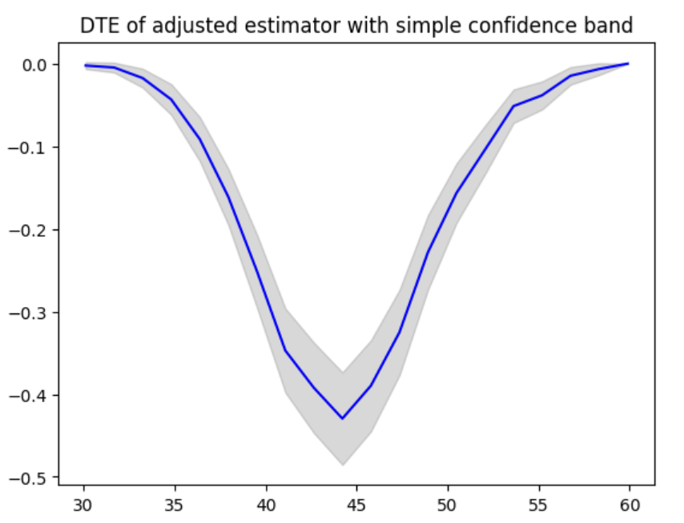
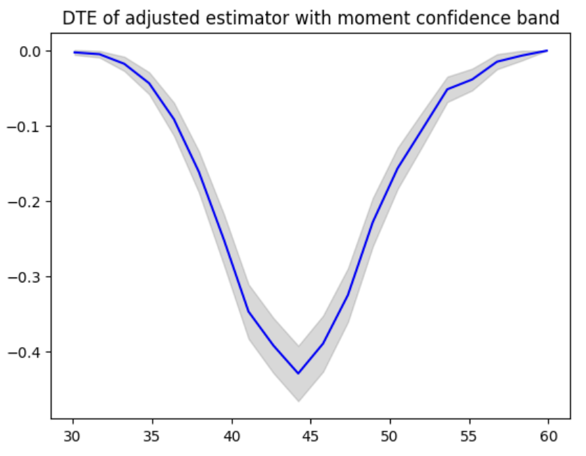
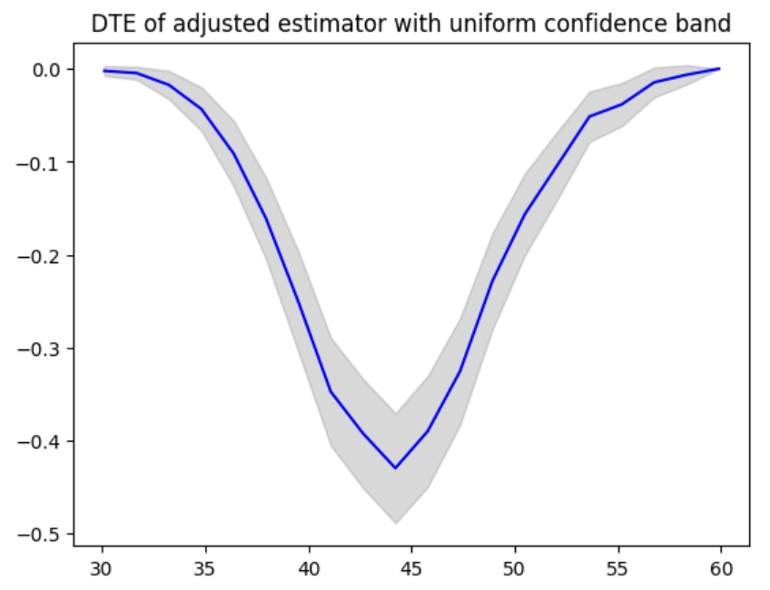

Get Started
=======================

This page contains basic usage of dte_adj library.

Generate data and train cumulative distribution function.

.. code-block:: python

  import numpy as np

  def generate_data(n, d_x=100, rho=0.5):
      """
      Generate data according to the described data generating process (DGP).

      Args:
      n (int): Number of samples.
      d_x (int): Number of covariates. Default is 100.
      rho (float): Success probability for the Bernoulli distribution. Default is 0.5.

      Returns:
      X (np.ndarray): Covariates matrix of shape (n, d_x).
      D (np.ndarray): Treatment variable array of shape (n,).
      Y (np.ndarray): Outcome variable array of shape (n,).
      """
      # Generate covariates X from a uniform distribution on (0, 1)
      X = np.random.uniform(0, 1, (n, d_x))
      
      # Generate treatment variable D from a Bernoulli distribution with success probability rho
      D = np.random.binomial(1, rho, n)
      
      # Define beta_j and gamma_j according to the problem statement
      beta = np.zeros(d_x)
      gamma = np.zeros(d_x)
      
      # Set the first 50 values of beta and gamma to 1
      beta[:50] = 1
      gamma[:50] = 1
      
      # Compute the outcome Y
      U = np.random.normal(0, 1, n)  # Error term
      linear_term = np.dot(X, beta)
      quadratic_term = np.dot(X**2, gamma)
      
      # Outcome equation
      Y = D + linear_term + quadratic_term + U
      
      return X, D, Y

  n = 100  # Sample size
  X, D, Y = generate_data(n)

Then, let's build an empirical cumulative distribution function (CDF).

.. code-block:: python

  import dte_adj
  estimator = dte_adj.SimpleDistributionEstimator()
  estimator.fit(X, D, Y)
  cdf = estimator.predict(D, Y)

Distributional treatment effect (DTE) can be computed easily in the following code.

.. code-block:: python

  dte, lower_bound, upper_bound = estimator.predict_dte(target_treatment_arm=1, control_treatment_arm=0, locations=np.sort(Y), variance_type="simple")

An convenience function is available to visualize distribution effects. This method can be used for other distribution parameters including Probability Treatment Effect (PTE) and Quantile Treatment Effect (QTE).

.. code-block:: python

  plot(np.sort(Y), dte, lower_bound, upper_bound, title="DTE of simple estimator")

To initialize the adjusted distribution function, the base model for conditional distribution function needs to be passed.
In the following example, we use Logistic Regression.

.. code-block:: python

  from sklearn.linear_model import LogisticRegression
  logit = LogisticRegression()
  estimator = dte_adj.AdjustedDistributionEstimator(logit, folds=3)
  estimator.fit(X, D, Y)
  cdf = estimator.predict(D, Y)

DTE can be computed and visualized in the following code.

.. code-block:: python

  dte, lower_bound, upper_bound = estimator.predict_dte(target_treatment_arm=1, control_treatment_arm=0, locations=np.sort(Y), variance_type="simple")
  plot(np.sort(Y), dte, lower_bound, upper_bound, title="DTE of adjusted estimator with simple confidence band")

Confidence bands can be computed in different ways. In the following code, we used moment method to calculate the confidence bands.

.. code-block:: python

  dte, lower_bound, upper_bound = estimator.predict_dte(target_treatment_arm=1, control_treatment_arm=0, locations=np.sort(Y), variance_type="moment")
  plot(np.sort(Y), dte, lower_bound, upper_bound, title="DTE of adjusted estimator with moment confidence band")

Also, uniform confidence band is used when "uniform" is specified for the "variance_type" argument.

.. code-block:: python

  dte, lower_bound, upper_bound = estimator.predict_dte(target_treatment_arm=1, control_treatment_arm=0, locations=np.sort(Y), variance_type="uniform")
  plot(np.sort(Y), dte, lower_bound, upper_bound, title="DTE of adjusted estimator with uniform confidence band")

To compute PTE, we can use "predict_pte" method.

.. code-block:: python

  locations = np.linspace(Y.min(), Y.max(), 20)
  pte, lower_bound, upper_bound = estimator.predict_pte(target_treatment_arm=1, control_treatment_arm=0, width=1, locations=locations, variance_type="simple")
  plot(locations, pte, lower_bound, upper_bound, chart_type="bar", title="PTE of adjusted estimator with simple confidence band")

.. image:: _static/pte_simple.png
   :alt: PTE of adjusted estimator with simple confidence band
   :height: 300px
   :width: 450px
   :align: center

To compute QTE, we can use "predict_qte" method. The confidence band is computed by bootstrap method.

.. code-block:: python

  quantiles = np.array([0.1 * i for i in range(1, 10)], dtype=np.float32)
  qte, lower_bound, upper_bound = estimator.predict_qte(target_treatment_arm=1, control_treatment_arm=0, quantiles=quantiles, n_bootstrap=30)
  plot(quantiles, qte, lower_bound, upper_bound, title="QTE of adjusted estimator")

