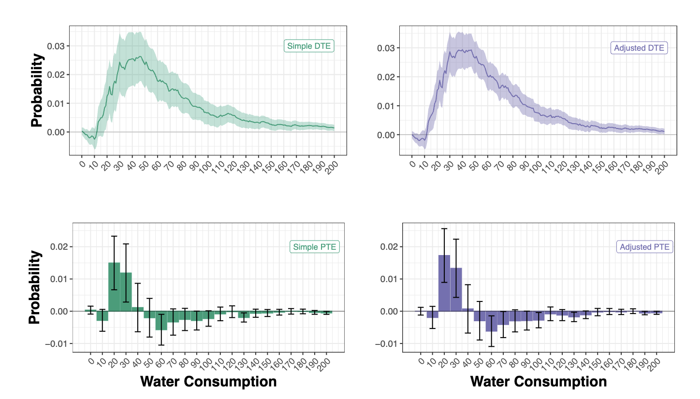

dte_adj
=======

A Python Package for Estimating Distribution Treatment Effects
--------------------------------------------------------------

`dte_adj` is a Python package for estimating distribution treatment effects in randomized experiments.
It provides APIs for conducting regression adjustment to estimate precise distribution functions, enabling deeper insights beyond average treatment effects through machine learning-enhanced estimation methods.

Estimator Types
---------------

The package provides several types of estimators for computing distribution treatment effects:

* **Simple Randomization Estimators**: For estimating distributional effects in simple randomized experiments where treatment assignment is independent of all covariates
* **Covariate Adaptive Randomization Estimators**: For estimating distributional effects under covariate-adaptive randomization (CAR) designs, including stratified block randomization and other adaptive schemes
* **Local Distribution Estimators**: For estimating local distribution treatment effects weighted by treatment propensity within strata

Theoretical Foundations
-----------------------

For theoretical foundations, see:

* **Simple randomization**: Byambadalai et al. (2024) [#simple2024]_
* **Covariate-adaptive randomization**: Byambadalai et al. (2025) [#car2025]_
* **Multi-task learning**: Hirata et al. (2025) [#multitask2025]_
* **Imperfect compliance**: Byambadalai et al. (2024) [#compliance2024]_

.. [#simple2024] Byambadalai, U., Oka, T., & Yasui, S. (2024). Estimating Distributional Treatment Effects in Randomized Experiments: Machine Learning for Variance Reduction. In Proceedings of the 41st International Conference on Machine Learning (ICML'24). `arXiv:2407.16037 <https://arxiv.org/abs/2407.16037>`_.

.. [#car2025] Byambadalai, U., Hirata, T., Oka, T., & Yasui, S. (2025). On Efficient Estimation of Distributional Treatment Effects under Covariate-Adaptive Randomization. In Proceedings of the 42nd International Conference on Machine Learning (ICML'25). `arXiv:2506.05945 <https://arxiv.org/abs/2506.05945>`_.

.. [#multitask2025] Hirata, T., Byambadalai, U., Oka, T., Yasui, S., & Uto, S. (2025). Efficient and Scalable Estimation of Distributional Treatment Effects with Multi-Task Neural Networks. arXiv preprint `arXiv:2507.07738 <https://arxiv.org/abs/2507.07738>`_.

.. [#compliance2024] Byambadalai, U., Hirata, T., Oka, T., & Yasui, S. (2024). Beyond the Average: Distributional Causal Inference under Imperfect Compliance. arXiv preprint `arXiv:2509.15594 <https://arxiv.org/abs/2509.15594>`_.

.. toctree::
   :maxdepth: 1
   :caption: Contents:

   installation
   get_started
   tutorials
   api_reference
   contributing

Indices and tables
~~~~~~~~~~~~~~~~~~

* :ref:`genindex`
* :ref:`modindex`
* :ref:`search`

License
~~~~~~~
MIT License
