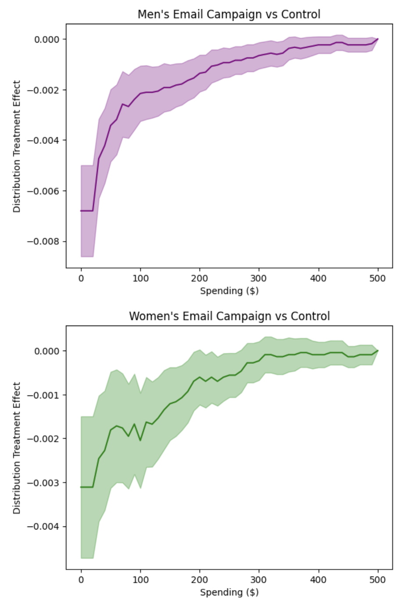
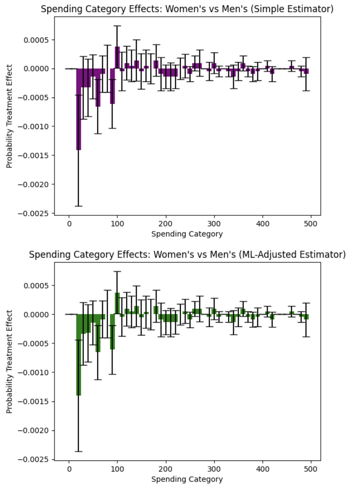

Hillstrom Email Marketing Experiment
====================================

The Hillstrom email marketing dataset is a classic example from digital marketing, involving 64,000 customers randomly assigned to receive either a men's merchandise email, women's merchandise email, or no email (control). This experiment allows us to examine which email campaign strategy is most effective using revenue as the outcome.

**Background**: Kevin Hillstrom provided this dataset to demonstrate email marketing analytics. Customers who purchased within the last 12 months were randomly divided into three groups to test targeted email campaigns against a control group.

**Research Question**: Which email campaign performed best: the men's version or the women's version, and how do the effects vary across the revenue distribution?

Data Setup and Loading
~~~~~~~~~~~~~~~~~~~~~~~

.. code-block:: python

    import numpy as np
    import pandas as pd
    import matplotlib.pyplot as plt
    from sklearn.linear_model import LinearRegression
    from sklearn.preprocessing import LabelEncoder
    import dte_adj
    from dte_adj.plot import plot

    # Load the real Hillstrom dataset
    url = "http://www.minethatdata.com/Kevin_Hillstrom_MineThatData_E-MailAnalytics_DataMiningChallenge_2008.03.20.csv"
    df = pd.read_csv(url)

    print(f"Dataset shape: {df.shape}")
    print(f"Average spend by segment:\n{df.groupby('segment')['spend'].mean()}")

    # Prepare the data for dte_adj analysis
    # Create treatment indicator: 0=No E-Mail, 1=Mens E-Mail, 2=Women E-Mail
    treatment_mapping = {'No E-Mail': 0, 'Mens E-Mail': 1, 'Women E-Mail': 2}
    D = df['segment'].map(treatment_mapping).values

    # Use spend as the outcome variable (revenue)
    revenue = df['spend'].values

    zip_code_mapping = {'Surburban': 0, 'Rural': 1, 'Urban': 2}  # Note: typo in original data
    channel_mapping = {'Phone': 0, 'Web': 1, 'Multichannel': 2}

    # Create feature matrix
    features = pd.DataFrame({
        'recency': df['recency'],
        'history': df['history'],
        'history_segment': df['history_segment'].map(lambda s: int(s[0])),
        'mens': df['mens'],
        'womens': df['womens'],
        'zip_code': df['zip_code'].map(zip_code_mapping),
        'newbie': df['newbie'],
        'channel': df['channel'].map(channel_mapping)
    })

    X = features.values

    print(f"\nDataset size: {len(D):,} customers")
    print(f"Control group (No Email): {(D==0).sum():,} ({(D==0).mean():.1%})")
    print(f"Men's Email group: {(D==1).sum():,} ({(D==1).mean():.1%})")
    print(f"Women's Email group: {(D==2).sum():,} ({(D==2).mean():.1%})")
    print("Average Spend by Treatment:")
    print(f"No Email: ${revenue[D==0].mean():.2f}")
    print(f"Men's Email: ${revenue[D==1].mean():.2f}")
    print(f"Women's Email: ${revenue[D==2].mean():.2f}")

    # Also show conversion rates
    print("\nConversion Rates:")
    print(f"No Email: {df[df['segment']=='No E-Mail']['conversion'].mean():.3f}")
    print(f"Men's Email: {df[df['segment']=='Mens E-Mail']['conversion'].mean():.3f}")
    print(f"Women's Email: {df[df['segment']=='Women E-Mail']['conversion'].mean():.3f}")

Email Campaign Effectiveness Analysis
~~~~~~~~~~~~~~~~~~~~~~~~~~~~~~~~~~~~~~~

.. code-block:: python

    # Initialize estimators
    simple_estimator = dte_adj.SimpleDistributionEstimator()
    ml_estimator = dte_adj.AdjustedDistributionEstimator(
        LinearRegression(),
        folds=5
    )

    # Fit estimators on the full dataset
    simple_estimator.fit(X, D, revenue)
    ml_estimator.fit(X, D, revenue)

    # Define revenue evaluation points
    revenue_locations = np.linspace(0, 500, 51)

Women's Email vs Control Analysis
~~~~~~~~~~~~~~~~~~~~~~~~~~~~~~~~~~

First, let's examine how the Women's email campaign performs compared to no email (control):

.. code-block:: python

    # Compute DTE: Women's email vs Control
    dte_women_ctrl, lower_women_ctrl, upper_women_ctrl = simple_estimator.predict_dte(
        target_treatment_arm=2,  # Women's email
        control_treatment_arm=0,  # No email control
        locations=revenue_locations,
        variance_type="moment"
    )

    # Visualize Women's vs Control using dte_adj's plot function
    plot(revenue_locations, dte_women_ctrl, lower_women_ctrl, upper_women_ctrl,
         title="Women's Email Campaign vs Control",
         xlabel="Spending ($)", ylabel="Distribution Treatment Effect")

Men's Email vs Control Analysis
~~~~~~~~~~~~~~~~~~~~~~~~~~~~~~~

Next, let's examine how the Men's email campaign performs compared to no email (control):

.. code-block:: python

    # Compute DTE: Men's email vs Control
    dte_men_ctrl, lower_men_ctrl, upper_men_ctrl = simple_estimator.predict_dte(
        target_treatment_arm=1,  # Men's email
        control_treatment_arm=0,  # No email control
        locations=revenue_locations,
        variance_type="moment"
    )

    # Visualize Men's vs Control using dte_adj's plot function
    plot(revenue_locations, dte_men_ctrl, lower_men_ctrl, upper_men_ctrl,
         title="Men's Email Campaign vs Control",
         xlabel="Spending ($)", ylabel="Distribution Treatment Effect", color="purple")

Spending Category Effects: Each Campaign vs Control
~~~~~~~~~~~~~~~~~~~~~~~~~~~~~~~~~~~~~~~~~~~~~~~~~~~

Let's also examine how each campaign affects spending in specific intervals using Probability Treatment Effects (PTE):

.. code-block:: python

    # Compute PTE: Women's email vs Control
    pte_women_ctrl, pte_lower_women_ctrl, pte_upper_women_ctrl = simple_estimator.predict_pte(
        target_treatment_arm=2,  # Women's email
        control_treatment_arm=0,  # No email control
        locations=np.insert(revenue_locations, 0, -1),
        variance_type="moment"
    )

    # Compute PTE: Men's email vs Control
    pte_men_ctrl, pte_lower_men_ctrl, pte_upper_men_ctrl = simple_estimator.predict_pte(
        target_treatment_arm=1,  # Men's email
        control_treatment_arm=0,  # No email control
        locations=np.insert(revenue_locations, 0, -1),
        variance_type="moment"
    )

    # Visualize PTE results using dte_adj's plot function with bar charts side by side
    import matplotlib.pyplot as plt

    # Create subplots for side-by-side comparison
    fig, (ax1, ax2) = plt.subplots(1, 2, figsize=(15, 6))

    # Women's vs Control PTE
    plot(revenue_locations[1:], pte_women_ctrl, pte_lower_women_ctrl, pte_upper_women_ctrl,
        chart_type="bar",
        title="Women's Email vs Control",
        xlabel="Spending Category ($)", ylabel="Probability Treatment Effect",
        ax=ax1)

    # Men's vs Control PTE
    plot(revenue_locations[1:], pte_men_ctrl, pte_lower_men_ctrl, pte_upper_men_ctrl,
        chart_type="bar",
        title="Men's Email vs Control",
        xlabel="Spending Category ($)", ylabel="Probability Treatment Effect",
        color="purple", ax=ax2)

    plt.tight_layout()
    plt.show()

The side-by-side PTE analysis produces the following visualization:

.. image:: ../_static/hillstorm_pte_control.png
   :alt: Hillstrom Email Campaigns vs Control PTE Analysis
   :width: 800px
   :align: center

These bar charts show how each email campaign affects the probability of customers spending in specific intervals compared to no email:

**Women's Email vs Control (Left Panel)**: The bar chart reveals specific spending intervals where women's email campaigns increase or decrease customer probability. Positive bars indicate intervals where the campaign increases the likelihood of spending in that range, while negative bars show intervals where it decreases probability.

**Men's Email vs Control (Right Panel)**: Similarly shows the interval-specific effects of men's email campaigns. The side-by-side comparison allows direct assessment of which campaign is more effective in driving specific spending behaviors.

**Key Insights from the Hillstrom Email Campaign Analysis**:

The distributional treatment effects and probability treatment effects reveal several important patterns in how email campaigns affect customer spending behavior:

1. **Email Campaigns Reduce Zero Spending**: Both men's and women's email campaigns show strong negative effects at the $0 spending level, indicating that email campaigns successfully convert non-purchasers into purchasers. This confirms that email marketing has a clear activation effect.

2. **Spending Category Redistribution**: The PTE analysis reveals how campaigns redistribute customers across spending intervals. Both campaigns show clear redistribution patterns, with negative effects in the $0 spending category (reducing non-purchase probability) and varying effects across other spending ranges. This redistribution pattern confirms that campaigns shift spending behavior rather than uniformly increasing it across all categories.

3. **Campaign-Specific Interval Effects**: The side-by-side PTE comparison reveals distinct patterns between campaigns. Women's email campaigns show stronger effects in certain spending intervals (particularly in moderate spending ranges), while men's campaigns display different interval-specific patterns. The visual comparison makes it clear that each campaign has optimal spending ranges where it excels, providing actionable insights for customer segmentation and targeting strategies.

4. **Statistical Significance Across Intervals**: The confidence intervals in both DTE and PTE analyses reveal that the most reliable effects occur at the zero spending level and in low-to-moderate spending ranges. PTE analysis provides additional granularity by showing which specific spending intervals have statistically significant changes in probability.

5. **Business Implications**: Email campaigns are most effective at converting non-buyers to buyers and redistributing customers toward moderate purchase amounts. The campaigns have minimal effect on driving high-value purchases ($200+). The PTE analysis provides actionable insights for campaign optimization by identifying which spending intervals are most responsive to each campaign type, enabling more precise targeting and resource allocation strategies.

This distributional analysis reveals that email marketing's primary value lies in customer activation (reducing zero spending) and encouraging moderate purchase amounts, rather than dramatically increasing high-value purchases. The heterogeneous effects across the spending distribution provide actionable insights for optimizing email campaign strategies and customer segmentation.

Direct Campaign Comparison: Men's vs Women's Email
~~~~~~~~~~~~~~~~~~~~~~~~~~~~~~~~~~~~~~~~~~~~~~~~~~~

Finally, let's directly compare the two email campaigns to answer the key research question.
This time we estimate the distribution treatment effects with regression adjustment using linear regression for higher precision.

.. code-block:: python

    # Compute DTE: Women's vs Men's email campaigns
    dte_simple, lower_simple, upper_simple = simple_estimator.predict_dte(
        target_treatment_arm=2,  # Women's email
        control_treatment_arm=1,  # Men's email (as "control")
        locations=revenue_locations,
        variance_type="moment"
    )

    dte_ml, lower_ml, upper_ml = ml_estimator.predict_dte(
        target_treatment_arm=2,  # Women's email
        control_treatment_arm=1,  # Men's email
        locations=revenue_locations,
        variance_type="moment"
    )

    # Visualize the distribution treatment effects using dte_adj's built-in plot function
    fig, (ax1, ax2) = plt.subplots(1, 2, figsize=(15, 6))

    # Simple estimator
    plot(revenue_locations, dte_simple, lower_simple, upper_simple,
        title="Email Campaign Comparison: Women's vs Men's (Simple Estimator)",
        xlabel="Spending ($)", ylabel="Distribution Treatment Effect",
        color="purple",
        ax=ax1)

    # ML-adjusted estimator
    plot(revenue_locations, dte_ml, lower_ml, upper_ml,
        title="Email Campaign Comparison: Women's vs Men's (ML-Adjusted Estimator)",
        xlabel="Spending ($)", ylabel="Distribution Treatment Effect",
        ax=ax2)

    plt.tight_layout()
    plt.show()

The analysis produces the following distribution treatment effects visualization:

.. image:: ../_static/hillstorm_dte.png
   :alt: Hillstrom Email Marketing DTE Analysis
   :width: 800px
   :align: center

The side-by-side plots show the distribution treatment effects (DTE) comparing Women's vs Men's email campaigns across different spending levels. Key observations:

**DTE Interpretation**: The predominantly positive DTE values indicate that women's campaigns increase the cumulative probability of customers spending at or below each threshold compared to men's campaigns. This means women's campaigns result in more customers having lower revenue levels, which is unfavorable for business outcomes.

**Men's Campaign Superiority**: The statistical significance of positive DTE values across most spending levels provides strong evidence that men's campaigns outperform women's campaigns by reducing the probability of customers spending small amounts and encouraging higher revenue per customer.

**Business Implication**: The DTE analysis clearly demonstrates that men's campaigns are superior for revenue maximization, as they consistently reduce the cumulative probability of low spending levels, effectively shifting customers toward higher revenue categories.

Revenue Category Analysis with PTE
~~~~~~~~~~~~~~~~~~~~~~~~~~~~~~~~~~~

.. code-block:: python

    # Compute Probability Treatment Effects
    pte_simple, pte_lower_simple, pte_upper_simple = simple_estimator.predict_pte(
        target_treatment_arm=1,  # Women's email
        control_treatment_arm=0,  # Men's email
        locations=np.insert(revenue_locations, 0, -1),
        variance_type="moment"
    )

    pte_ml, pte_lower_ml, pte_upper_ml = ml_estimator.predict_pte(
        target_treatment_arm=1,  # Women's email
        control_treatment_arm=0,  # Men's email
        locations=np.insert(revenue_locations, 0, -1),
        variance_type="moment"
    )

    fig, (ax1, ax2) = plt.subplots(1, 2, figsize=(15, 6))

    # Simple estimator
    plot(revenue_locations[1:], pte_simple, pte_lower_simple, pte_upper_simple,
        chart_type="bar",
        title="Spending Category Effects: Women's vs Men's (Simple Estimator)",
        xlabel="Spending Category", ylabel="Probability Treatment Effect", color="purple",
        ax=ax1)

    # ML-adjusted estimator
    plot(revenue_locations[1:], pte_ml, pte_lower_ml, pte_upper_ml,
        chart_type="bar",
        title="Spending Category Effects: Women's vs Men's (ML-Adjusted Estimator)",
        xlabel="Spending Category", ylabel="Probability Treatment Effect",
        ax=ax2)
    plt.tight_layout()
    plt.show()

The Probability Treatment Effects analysis produces the following visualization:

The side-by-side bar charts show probability treatment effects across different spending intervals, revealing the true story of campaign effectiveness:

**Critical Finding - Zero Revenue Effect**: Women's campaigns show a positive effect in the $0 revenue category, meaning they increase the probability of customers making no purchase compared to men's campaigns. This is a negative outcome indicating that women's campaigns are less effective at driving any purchase behavior.

**Spending Category Analysis**: Men's campaigns demonstrate superior performance in driving actual revenue. The negative PTE values in revenue-generating categories for women's campaigns indicate that men's campaigns are more effective at encouraging customers to make purchases and spend meaningful amounts.

**Revenue Generation Patterns**: Men's campaigns show stronger performance in categories that generate actual revenue, while women's campaigns appear to be associated with higher non-purchase rates. This pattern suggests that men's campaigns are more effective at converting prospects into paying customers.

**Methodological Confirmation**: Both simple and ML-adjusted estimators confirm this pattern, with the ML-adjusted analysis providing more precise estimates that strengthen the evidence for men's campaign superiority in driving revenue-generating behavior.

**Strategic Implications**: Men's campaigns should be prioritized for revenue generation and customer conversion goals, as they demonstrate superior ability to drive actual purchases rather than just engagement.

**Key PTE Findings**:

1. **Men's Campaigns Drive More Purchases**: The critical finding is that women's campaigns increase the probability of zero revenue (non-purchase) compared to men's campaigns. This means men's campaigns are more effective at converting prospects into paying customers.

2. **Revenue Generation Superiority**: Men's campaigns show consistently better performance in revenue-generating categories. The negative PTE values for women's campaigns in spending intervals indicate that men's campaigns drive more customers to make actual purchases across most revenue ranges.

3. **Quantified Business Impact**: The analysis reveals that men's campaigns reduce non-purchase rates and increase the probability of revenue generation. Switching from women's to men's campaigns could improve overall conversion rates and revenue per customer.

4. **Statistical Significance**: The statistical significance of the zero-revenue effect for women's campaigns provides strong evidence that men's campaigns are superior for business outcomes focused on revenue generation rather than just engagement.

**Conclusion**: Using the real Hillstrom dataset with 64,000 customers, the distributional analysis reveals nuanced patterns in how email campaigns affect customer spending. The analysis goes beyond simple average comparisons to show how treatment effects vary across the entire spending distribution, providing insights into which customer segments respond best to different campaign types. This demonstrates the power of distribution treatment effect analysis for understanding heterogeneous responses in digital marketing experiments.

Next Steps
~~~~~~~~~~

- Try with your own randomized experiment data
- Experiment with different ML models (XGBoost, Neural Networks) for adjustment
- Explore stratified estimators for covariate-adaptive randomization designs
- Use multi-task learning (``is_multi_task=True``) for computational efficiency with many locations
