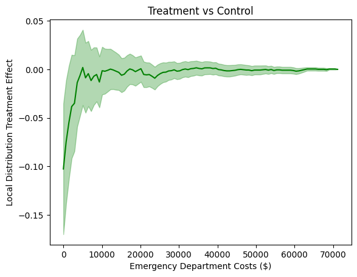
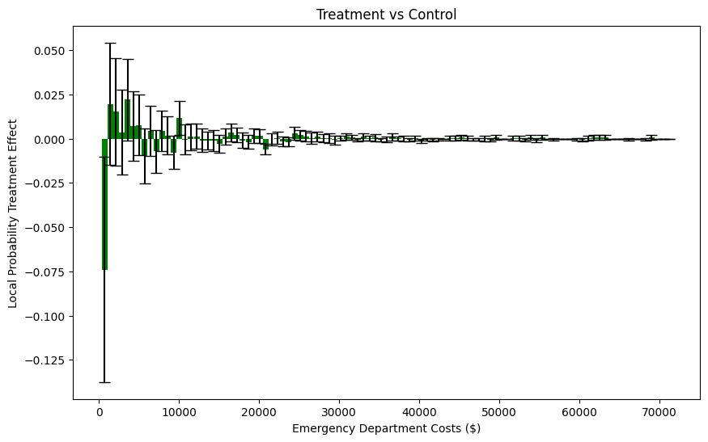
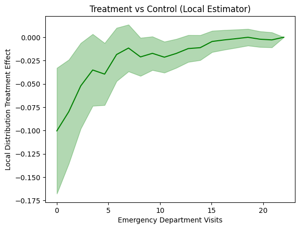
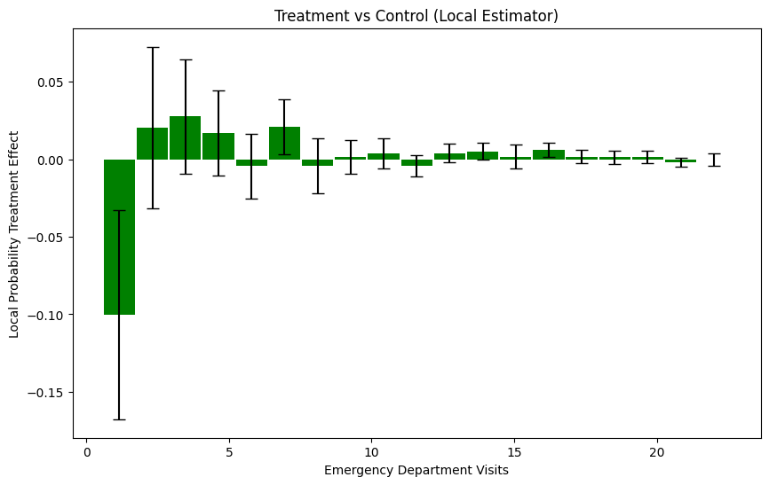
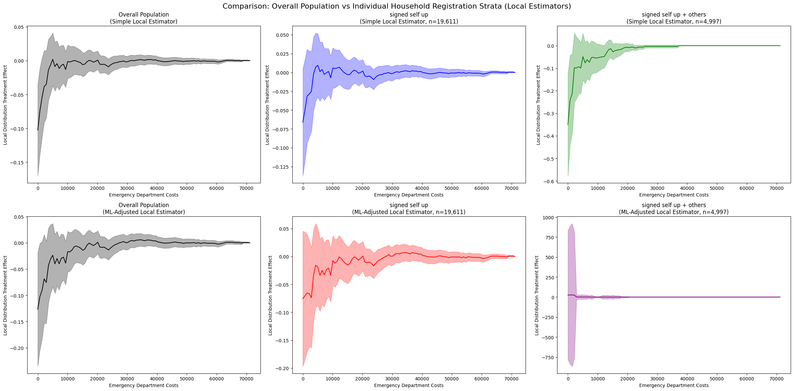

Oregon Health Insurance Experiment
====================================

The Oregon Health Insurance Experiment is a landmark randomized controlled trial conducted in 2008, where approximately 24,000 low-income adults were randomly assigned to either receive the opportunity to enroll in Medicaid (treatment group) or remain uninsured (control group). This unique natural experiment allows us to examine how public health insurance affects healthcare utilization and costs across the entire distribution.

**Background**: Due to budget constraints, Oregon decided to expand its Medicaid program through a lottery system, randomly selecting eligible individuals for enrollment opportunities. This created a rare natural experiment with non-compliance (not all selected individuals enrolled) that enables rigorous causal evaluation using Local Distribution Treatment Effects (LDTE) methodology.

**Research Question**: How does Medicaid assignment (and enrollment) affect healthcare utilization (emergency department visits and costs), accounting for non-compliance, and how do these effects vary across the entire distribution of healthcare outcomes?

Data Setup and Loading
~~~~~~~~~~~~~~~~~~~~~~~

**Data Source**: The Oregon Health Insurance Experiment data used in this tutorial is publicly available through the National Bureau of Economic Research (NBER). You can download the dataset from the official NBER Public Use Data Archive at: https://www.nber.org/research/data/oregon-health-insurance-experiment-data

The dataset includes multiple files containing information about participants in the experiment:

- ``oregonhie_descriptive_vars.dta``: Demographic and baseline characteristics
- ``oregonhie_ed_vars.dta``: Emergency department utilization data
- ``oregonhie_inperson_vars.dta``: In-person survey responses
- ``oregonhie_stateprograms_vars.dta``: State program participation data

This data supports research on how health insurance affects healthcare utilization and is maintained by researchers Amy Finkelstein and Katherine Baicker. Please ensure you comply with the data use agreements when downloading and using this dataset.

**Important**: When using this dataset for research or publications, appropriate citation is required as specified in the NBER data use agreement.

.. code-block:: python

    import numpy as np
    import pandas as pd
    import matplotlib.pyplot as plt
    import os
    from sklearn.linear_model import LinearRegression
    from sklearn.preprocessing import LabelEncoder
    import dte_adj
    from dte_adj.plot import plot

    # Load the Oregon Health Insurance Experiment dataset
    base_path = "OHIE_Public_Use_Files/OHIE_Data"
    df_descriptive = pd.read_stata(os.path.join(base_path, "oregonhie_descriptive_vars.dta"))
    df_ed = pd.read_stata(os.path.join(base_path, "oregonhie_ed_vars.dta"))
    df_inp = pd.read_stata(os.path.join(base_path, "oregonhie_inperson_vars.dta"))
    df_state = pd.read_stata(os.path.join(base_path, "oregonhie_stateprograms_vars.dta"))

    # Merge all datasets
    df = (
        df_descriptive
        .merge(df_ed, on='person_id', how='inner')
        .merge(df_inp, on='person_id', how='left')
        .merge(df_state, on='person_id', how='inner')
    )

    print(f"Dataset shape: {df.shape}")
    print(f"Average num_visit_cens_ed by enrollment:\n{df.groupby('ohp_all_ever_inperson')['num_visit_cens_ed'].mean()}")
    print(f"Average ed_charg_tot_ed by enrollment:\n{df.groupby('ohp_all_ever_inperson')['ed_charg_tot_ed'].mean()}")

    # Prepare the data for dte_adj analysis
    # Create treatment assignment (instrumental variable): 0=Not selected, 1=Selected
    treatment_assignment_mapping = {'Not selected': 0, 'Selected': 1}
    df['Z'] = df['treatment'].map(treatment_assignment_mapping).astype(float).fillna(-1).astype(int)

    # Create actual treatment indicator: 0=Not enrolled, 1=Enrolled, -1=Missing
    treatment_mapping = {'NOT enrolled': 0, 'Enrolled': 1}
    df['D'] = df['ohp_all_ever_inperson'].map(treatment_mapping).astype(float).fillna(-1).astype(int)

    # Use emergency department costs and visits as outcome variables
    df['Y_ED_CHARG_TOT_ED'] = df['ed_charg_tot_ed'].fillna(0)
    df['Y_NUM_VISIT_CENS_ED'] = df['num_visit_cens_ed'].fillna(0)

    # Create strata based on household size
    df['strata'] = df['numhh_list']

    # Create feature mappings for categorical variables
    gender_mapping = {'Male': 0, 'Female': 1, 'Transgender F to M': 2, 'Transgender M to F': 3}
    health_last12_mapping = {'1: Very poor': 1, '2: Poor': 2, '3: Fair': 3, '4: Good': 4, '5: Very good': 5, '6: Excellent': 6}
    edu_mapping = {'HS diploma or GED': 0, 'Post HS, not 4-year': 1, 'Less than HS': 2, '4 year degree or more': 3}

    df['age'] = 2008 - df['birthyear_list']
    df['gender_inp'] = df['gender_inp'].map(gender_mapping).astype(float).fillna(-1).astype(int)
    df['health_last12_inp'] = df['health_last12_inp'].map(health_last12_mapping).astype(float).fillna(-1).astype(int)
    df['edu_inp'] = df['edu_inp'].map(edu_mapping).astype(float).fillna(-1).astype(int)

    # Select control variables: pre-randomization ED utilization variables
    ctrl_cols = [col for col in df_ed.columns if 'pre' in col and 'num' in col]
    ctrl_cols.append('charg_tot_pre_ed')
    selected_cols = ['person_id', 'strata', 'Y_NUM_VISIT_CENS_ED', 'Y_ED_CHARG_TOT_ED', 'Z', 'D'] + ctrl_cols + ['gender_inp', 'age', 'health_last12_inp', 'edu_inp']
    df = df[selected_cols]
    df = df[df.isna().any(axis=1) == False]

    # Create feature matrix (excluding treatment variables)
    features = pd.DataFrame(df[ctrl_cols + ['gender_inp', 'age', 'health_last12_inp', 'edu_inp']])
    X = features.values

    Z = df['Z'].values  # Treatment assignment (instrumental variable)
    D = df['D'].values  # Actual treatment (endogenous variable)
    strata = df['strata'].values  # Stratification variable
    Y_ED_CHARG_TOT_ED = df['Y_ED_CHARG_TOT_ED'].values
    Y_NUM_VISIT_CENS_ED = df['Y_NUM_VISIT_CENS_ED'].values

    print(f"\nDataset size: {len(D):,} people")
    print(f"Treatment assignment (Z) - Not selected: {(Z==0).sum():,} ({(Z==0).mean():.1%})")
    print(f"Treatment assignment (Z) - Selected: {(Z==1).sum():,} ({(Z==1).mean():.1%})")
    print(f"Actual treatment (D) - Not enrolled: {(D==0).sum():,} ({(D==0).mean():.1%})")
    print(f"Actual treatment (D) - Enrolled: {(D==1).sum():,} ({(D==1).mean():.1%})")
    print("\nCompliance rate (among those assigned to treatment):")
    print(f"Compliance rate: {(D[Z==1]==1).mean():.1%}")
    print("\nAverage Outcome by Actual Treatment (D):")
    print(f"Not enrolled (D=0): {Y_NUM_VISIT_CENS_ED[D==0].mean():.2f} visits, ${Y_ED_CHARG_TOT_ED[D==0].mean():.2f} in ED costs")
    print(f"Enrolled (D=1): {Y_NUM_VISIT_CENS_ED[D==1].mean():.2f} visits, ${Y_ED_CHARG_TOT_ED[D==1].mean():.2f} in ED costs")

Emergency Department Cost Analysis
~~~~~~~~~~~~~~~~~~~~~~~~~~~~~~~~~~

.. code-block:: python

    # Initialize LOCAL estimators for non-compliance scenario
    simple_local_estimator = dte_adj.SimpleLocalDistributionEstimator()
    ml_local_estimator = dte_adj.AdjustedLocalDistributionEstimator(
        LinearRegression(),
        folds=5
    )

    # Fit estimators: fit(covariates, treatment_arms, treatment_indicator, outcomes, strata)
    # treatment_arms = Z (Treatment assignment), treatment_indicator = D (Actual treatment)
    simple_local_estimator.fit(X, Z, D, Y_ED_CHARG_TOT_ED, strata)
    ml_local_estimator.fit(X, Z, D, Y_ED_CHARG_TOT_ED, strata)

    # Define evaluation points for emergency department costs
    outcome_ed_costs_locations = np.linspace(Y_ED_CHARG_TOT_ED.min(), Y_ED_CHARG_TOT_ED.max(), 100)

Local Distribution Treatment Effects: Medicaid Assignment vs Control
~~~~~~~~~~~~~~~~~~~~~~~~~~~~~~~~~~~~~~~~~~~~~~~~~~~~~~~~~~~~~~~~~~~~

First, let's examine how Medicaid assignment (accounting for non-compliance) affects the distribution of emergency department costs:

.. code-block:: python

    # Compute Local Distribution Treatment Effects (LDTE)
    ldte_ctrl, ldte_lower_ctrl, ldte_upper_ctrl = simple_local_estimator.predict_ldte(
        target_treatment_arm=1,  # Z=1 (assigned to treatment)
        control_treatment_arm=0,  # Z=0 (assigned to control)
        locations=outcome_ed_costs_locations
    )

    # Visualize Treatment vs Control using dte_adj's plot function
    plot(outcome_ed_costs_locations, ldte_ctrl, ldte_lower_ctrl, ldte_upper_ctrl,
         title="Treatment vs Control",
         xlabel="Emergency Department Costs ($)", ylabel="Local Distribution Treatment Effect")

Local Probability Treatment Effects: Cost Analysis
~~~~~~~~~~~~~~~~~~~~~~~~~~~~~~~~~~~~~~~~~~~~~~~~~~~

Let's also examine how Medicaid assignment affects the probability of incurring specific ranges of emergency department costs using Local Probability Treatment Effects (LPTE):

.. code-block:: python

    # Compute Local Probability Treatment Effects (LPTE)
    lpte_ctrl, lpte_lower_ctrl, lpte_upper_ctrl = simple_local_estimator.predict_lpte(
        target_treatment_arm=1,  # Z=1 (assigned to treatment)
        control_treatment_arm=0,  # Z=0 (assigned to control)
        locations=[-1] + outcome_ed_costs_locations
    )

    fig, ax = plt.subplots(figsize=(10, 6))

    # Visualize LPTE results using dte_adj's plot function with bar charts
    # Treatment vs Control LPTE
    plot(outcome_ed_costs_locations[1:], lpte_ctrl, lpte_lower_ctrl, lpte_upper_ctrl,
        chart_type="bar",
        title="Treatment vs Control",
        xlabel="Emergency Department Costs ($)", ylabel="Local Probability Treatment Effect",
        ax=ax)

    plt.tight_layout()
    plt.show()

Local Estimator Comparison: Simple vs ML-Adjusted (Costs)
~~~~~~~~~~~~~~~~~~~~~~~~~~~~~~~~~~~~~~~~~~~~~~~~~~~~~~~~~

Let's compare the results from both simple and machine learning-adjusted local estimators to examine the robustness of our findings:

.. code-block:: python

    # Compute LDTE: Treatment vs Control
    ldte_simple, lower_simple, upper_simple = simple_local_estimator.predict_ldte(
        target_treatment_arm=1,  # Z=1 Selected for treatment (Enrolled)
        control_treatment_arm=0,  # Z=0 Not selected for treatment (Not enrolled)
        locations=outcome_ed_costs_locations
    )

    ldte_ml, lower_ml, upper_ml = ml_local_estimator.predict_ldte(
        target_treatment_arm=1,  # Selected for treatment (Enrolled)
        control_treatment_arm=0,  # Not selected for treatment (Not enrolled)
        locations=outcome_ed_costs_locations
    )

    # Visualize the distribution treatment effects using dte_adj's built-in plot function
    fig, (ax1, ax2) = plt.subplots(1, 2, figsize=(15, 6))

    # Visualize Treatment vs Control using dte_adj's plot function
    plot(outcome_ed_costs_locations, ldte_simple, lower_simple, upper_simple,
         title="Treatment vs Control (Simple Local Estimator)",
         xlabel="Emergency Department Costs", ylabel="Local Distribution Treatment Effect",
         color="purple",
         ax=ax1)

    plot(outcome_ed_costs_locations, ldte_ml, lower_ml, upper_ml,
         title="Treatment vs Control (ML-Adjusted Local Estimator)",
         xlabel="Emergency Department Costs", ylabel="Local Distribution Treatment Effect",
         ax=ax2)

    plt.tight_layout()
    plt.show()

The analysis produces the following local distribution treatment effects visualization:

.. image:: ../_static/oregon_ldte_costs_comparison.png
   :alt: Oregon Health Insurance Experiment LDTE Analysis
   :width: 800px
   :align: center

**LDTE Interpretation**: The positive LDTE values indicate that Medicaid assignment increases the cumulative probability of individuals having emergency department costs at or below each threshold among compliers (those who enroll when selected). This suggests that while Medicaid increases overall ED utilization, it may also help contain costs for some individuals who actually enroll.

**Statistical Significance**: Both simple and ML-adjusted local estimators show similar patterns, providing robust evidence that Medicaid assignment has significant distributional effects on emergency department costs for compliers. The confidence intervals indicate that these effects are statistically significant across most cost levels.

**Non-Compliance Considerations**: The LDTE analysis accounts for the fact that not all individuals assigned to treatment actually enrolled in Medicaid, providing a more accurate estimate of the effects for those who actually receive treatment when assigned.

Cost Analysis with Local PTE
~~~~~~~~~~~~~~~~~~~~~~~~~~~~~

.. code-block:: python

    # Compute Local Probability Treatment Effects
    lpte_simple, lpte_lower_simple, lpte_upper_simple = simple_local_estimator.predict_lpte(
        target_treatment_arm=1,  # Z=1 Selected for treatment (Enrolled)
        control_treatment_arm=0,  # Z=0 Not selected for treatment (Not enrolled)
        locations=[-1] + outcome_ed_costs_locations
    )

    lpte_ml, lpte_lower_ml, lpte_upper_ml = ml_local_estimator.predict_lpte(
        target_treatment_arm=1,  # Z=1 Selected for treatment (Enrolled)
        control_treatment_arm=0,  # Z=0 Not selected for treatment (Not enrolled)
        locations=[-1] + outcome_ed_costs_locations
    )

    fig, (ax1, ax2) = plt.subplots(1, 2, figsize=(15, 6))

    # Simple local estimator
    plot(outcome_ed_costs_locations[1:], lpte_simple, lpte_lower_simple, lpte_upper_simple,
        chart_type="bar",
        title="Effects of Emergency Department Costs (Simple Local Estimator)",
        xlabel="Emergency Department Costs", ylabel="Local Probability Treatment Effect",
        color="purple",
        ax=ax1)

    # ML-adjusted local estimator
    plot(outcome_ed_costs_locations[1:], lpte_ml, lpte_lower_ml, lpte_upper_ml,
        chart_type="bar",
        title="Effects of Emergency Department Costs (ML-Adjusted Local Estimator)",
        xlabel="Emergency Department Costs", ylabel="Local Probability Treatment Effect",
        ax=ax2)
    plt.tight_layout()
    plt.show()

The Local Probability Treatment Effects analysis produces the following visualization:

.. image:: ../_static/oregon_lpte_costs_comparison.png
   :alt: Oregon Health Insurance Experiment LPTE Analysis
   :width: 800px
   :align: center

The side-by-side bar charts show probability treatment effects across different emergency department cost intervals, revealing how Medicaid enrollment affects healthcare utilization patterns:

**Cost Distribution Effects**: The LPTE analysis shows how Medicaid assignment changes the probability of compliers incurring emergency department costs in specific ranges. Positive bars indicate cost intervals where Medicaid assignment increases the likelihood of incurring costs in that range, while negative bars show intervals where it decreases the probability.

**Healthcare Utilization Patterns**: Both simple and ML-adjusted local estimators reveal consistent patterns in how Medicaid assignment affects emergency department utilization across different cost categories for compliers. The analysis shows that Medicaid assignment has heterogeneous effects, increasing utilization in some cost ranges while potentially reducing it in others.

**Access vs. Utilization Trade-offs**: The probability treatment effects reveal the complex relationship between health insurance coverage and emergency department use. While Medicaid provides access to care, the distributional effects suggest that it may help some individuals avoid very high-cost emergency situations while increasing utilization for routine or preventive care.

**Methodological Robustness**: Both simple and ML-adjusted local estimators confirm similar patterns, providing robust evidence for the distributional effects of Medicaid assignment on emergency department costs for compliers. The ML-adjusted analysis provides more precise estimates that account for confounding factors while handling non-compliance.

**Policy Implications**: Understanding these distributional effects is crucial for healthcare policy. The local analysis reveals that Medicaid's impact varies across the cost distribution for those who actually enroll when assigned, which has important implications for healthcare budgeting and understanding the true effects of public health insurance programs on compliers.

**Conclusion**: Using the real Oregon Health Insurance Experiment dataset with 24,000 participants, the local distributional analysis reveals nuanced patterns in how Medicaid assignment affects healthcare utilization among compliers. The analysis accounts for non-compliance and goes beyond simple average comparisons to show how treatment effects vary across the entire emergency department cost distribution, providing insights into how public health insurance impacts different segments of the population who actually enroll. This demonstrates the power of local distribution treatment effect analysis for understanding heterogeneous responses in healthcare policy interventions with non-compliance.

Emergency Department Visits Analysis
~~~~~~~~~~~~~~~~~~~~~~~~~~~~~~~~~~~~

Now let's examine how Medicaid enrollment affects the distribution of emergency department visits (rather than costs):

.. code-block:: python

    # Initialize local estimators for visits analysis
    simple_local_estimator = dte_adj.SimpleLocalDistributionEstimator()
    ml_local_estimator = dte_adj.AdjustedLocalDistributionEstimator(
        LinearRegression(),
        folds=5
    )

    # Fit local estimators on the full dataset
    # Parameters: X, treatment_arms, treatment_indicator, outcomes, strata
    simple_local_estimator.fit(X, Z, D, Y_NUM_VISIT_CENS_ED, strata)
    ml_local_estimator.fit(X, Z, D, Y_NUM_VISIT_CENS_ED, strata)

    # Define evaluation points for emergency department visits
    outcome_ed_visits_locations = np.linspace(Y_NUM_VISIT_CENS_ED.min(), Y_NUM_VISIT_CENS_ED.max(), 20)

Distribution Treatment Effects: Visits Analysis
~~~~~~~~~~~~~~~~~~~~~~~~~~~~~~~~~~~~~~~~~~~~~~

.. code-block:: python

    # Compute LDTE: Treatment vs Control
    ldte_ctrl, lower_ctrl, upper_ctrl = simple_local_estimator.predict_ldte(
        target_treatment_arm=1,  # Z=1 Selected for treatment (Enrolled)
        control_treatment_arm=0,  # Z=0 Not selected for treatment (Not enrolled)
        locations=outcome_ed_visits_locations
    )

    # LDTE: Treatment vs Control
    ldte_simple, lower_simple, upper_simple = simple_local_estimator.predict_ldte(
        target_treatment_arm=1,  # Z=1 Selected for treatment (Enrolled)
        control_treatment_arm=0,  # Z=0 Not selected for treatment (Not enrolled)
        locations=outcome_ed_visits_locations
    )

    ldte_ml, lower_ml, upper_ml = ml_local_estimator.predict_ldte(
        target_treatment_arm=1,  # Selected for treatment (Enrolled)
        control_treatment_arm=0,  # Not selected for treatment (Not enrolled)
        locations=outcome_ed_visits_locations
    )

    # Visualize the local distribution treatment effects using dte_adj's built-in plot function
    fig, (ax1, ax2) = plt.subplots(1, 2, figsize=(15, 6))

    # Visualize Treatment vs Control using dte_adj's plot function
    plot(outcome_ed_visits_locations, ldte_simple, lower_simple, upper_simple,
         title="Treatment vs Control (Simple Local Estimator)",
         xlabel="Emergency Department Visits", ylabel="Local Distribution Treatment Effect",
         color="purple",
         ax=ax1)

    plot(outcome_ed_visits_locations, ldte_ml, lower_ml, upper_ml,
         title="Treatment vs Control (ML-Adjusted Local Estimator)",
         xlabel="Emergency Department Visits", ylabel="Local Distribution Treatment Effect",
         ax=ax2)

    plt.tight_layout()
    plt.show()

Probability Treatment Effects: Visits Analysis
~~~~~~~~~~~~~~~~~~~~~~~~~~~~~~~~~~~~~~~~~~~~~~~~~~~~~~

.. code-block:: python

    # Compute LPTE: Treatment vs Control
    lpte_ctrl, lpte_lower_ctrl, lpte_upper_ctrl = simple_local_estimator.predict_lpte(
        target_treatment_arm=1,  # Z=1 Selected for treatment (Enrolled)
        control_treatment_arm=0,  # Z=0 Not selected for treatment (Not enrolled)
        locations=[-1] + outcome_ed_visits_locations
    )

    # Compute Local Probability Treatment Effects
    lpte_simple, lpte_lower_simple, lpte_upper_simple = simple_local_estimator.predict_lpte(
        target_treatment_arm=1,  # Z=1 Selected for treatment (Enrolled)
        control_treatment_arm=0,  # Z=0 Not selected for treatment (Not enrolled)
        locations=[-1] + outcome_ed_visits_locations
    )

    lpte_ml, lpte_lower_ml, lpte_upper_ml = ml_local_estimator.predict_lpte(
        target_treatment_arm=1,  # Z=1 Selected for treatment (Enrolled)
        control_treatment_arm=0,  # Z=0 Not selected for treatment (Not enrolled)
        locations=[-1] + outcome_ed_visits_locations
    )

    fig, (ax1, ax2) = plt.subplots(1, 2, figsize=(15, 6))

    # Simple local estimator
    plot(outcome_ed_visits_locations[1:], lpte_simple, lpte_lower_simple, lpte_upper_simple,
        chart_type="bar",
        title="Effects of Emergency Department Visits (Simple Local Estimator)",
        xlabel="Emergency Department Visits", ylabel="Local Probability Treatment Effect",
        color="purple",
        ax=ax1)

    # ML-adjusted local estimator
    plot(outcome_ed_visits_locations[1:], lpte_ml, lpte_lower_ml, lpte_upper_ml,
        chart_type="bar",
        title="Effects of Emergency Department Visits (ML-Adjusted Local Estimator)",
        xlabel="Emergency Department Visits", ylabel="Local Probability Treatment Effect",
        ax=ax2)

    plt.tight_layout()
    plt.show()

Local Estimator Comparison: Simple vs ML-Adjusted (Visits)
~~~~~~~~~~~~~~~~~~~~~~~~~~~~~~~~~~~~~~~~~~~~~~~~~~~~~~~~~

Let's compare the results from both simple and machine learning-adjusted local estimators for visits analysis:

.. code-block:: python

    # Compute LDTE: Treatment vs Control
    ldte_simple, lower_simple, upper_simple = simple_local_estimator.predict_ldte(
        target_treatment_arm=1,  # Z=1 Selected for treatment (Enrolled)
        control_treatment_arm=0,  # Z=0 Not selected for treatment (Not enrolled)
        locations=outcome_ed_visits_locations
    )

    ldte_ml, lower_ml, upper_ml = ml_local_estimator.predict_ldte(
        target_treatment_arm=1,  # Selected for treatment (Enrolled)
        control_treatment_arm=0,  # Not selected for treatment (Not enrolled)
        locations=outcome_ed_visits_locations
    )

    # Visualize the local distribution treatment effects using dte_adj's built-in plot function
    fig, (ax1, ax2) = plt.subplots(1, 2, figsize=(15, 6))

    # Visualize Treatment vs Control using dte_adj's plot function
    plot(outcome_ed_visits_locations, ldte_simple, lower_simple, upper_simple,
         title="Treatment vs Control (Simple Local Estimator)",
         xlabel="Emergency Department Visits", ylabel="Local Distribution Treatment Effect",
         color="purple",
         ax=ax1)

    plot(outcome_ed_visits_locations, ldte_ml, lower_ml, upper_ml,
         title="Treatment vs Control (ML-Adjusted Local Estimator)",
         xlabel="Emergency Department Visits", ylabel="Local Distribution Treatment Effect",
         ax=ax2)

    plt.tight_layout()
    plt.show()

.. image:: ../_static/oregon_ldte_visits_comparison.png
   :alt: Oregon Health Insurance Experiment LDTE Visits Analysis
   :width: 800px
   :align: center

Visits Analysis with Local PTE
~~~~~~~~~~~~~~~~~~~~~~~~~~~~~~~

.. code-block:: python

    # Compute Local Probability Treatment Effects
    lpte_simple, lpte_lower_simple, lpte_upper_simple = simple_local_estimator.predict_lpte(
        target_treatment_arm=1,  # Z=1 Selected for treatment (Enrolled)
        control_treatment_arm=0,  # Z=0 Not selected for treatment (Not enrolled)
        locations=[-1] + outcome_ed_visits_locations
    )

    lpte_ml, lpte_lower_ml, lpte_upper_ml = ml_local_estimator.predict_lpte(
        target_treatment_arm=1,  # Z=1 Selected for treatment (Enrolled)
        control_treatment_arm=0,  # Z=0 Not selected for treatment (Not enrolled)
        locations=[-1] + outcome_ed_visits_locations
    )

    fig, (ax1, ax2) = plt.subplots(1, 2, figsize=(15, 6))

    # Simple local estimator
    plot(outcome_ed_visits_locations[1:], lpte_simple, lpte_lower_simple, lpte_upper_simple,
        chart_type="bar",
        title="Effects of Emergency Department Visits (Simple Local Estimator)",
        xlabel="Emergency Department Visits", ylabel="Local Probability Treatment Effect",
        color="purple",
        ax=ax1)

    # ML-adjusted local estimator
    plot(outcome_ed_visits_locations[1:], lpte_ml, lpte_lower_ml, lpte_upper_ml,
        chart_type="bar",
        title="Effects of Emergency Department Visits (ML-Adjusted Local Estimator)",
        xlabel="Emergency Department Visits", ylabel="Local Probability Treatment Effect",
        ax=ax2)

    plt.tight_layout()
    plt.show()

.. image:: ../_static/oregon_lpte_visits_comparison.png
   :alt: Oregon Health Insurance Experiment LPTE Visits Analysis
   :width: 800px
   :align: center

**Key Insights from Visits Analysis**:

The emergency department visits analysis reveals complementary patterns to the cost analysis:

**Visit Frequency Effects**: Medicaid assignment shows distinct effects on the probability of different visit frequencies for compliers. The LPTE analysis reveals which visit count categories are most affected by Medicaid assignment among those who actually enroll.

**Utilization Patterns**: The local distributional analysis of visits provides insights into how health insurance assignment affects the frequency of emergency department use for compliers, separate from the cost per visit. This helps distinguish between intensive margin effects (cost per visit) and extensive margin effects (frequency of visits) for the complier population.

**Policy Understanding**: By analyzing both costs and visits separately using local estimators, we gain a more complete picture of how Medicaid assignment affects emergency department utilization for those who actually enroll when selected. This dual analysis is crucial for understanding the full impact of health insurance policy on healthcare delivery in non-compliance scenarios.

**Methodological Robustness**: Both simple and ML-adjusted local estimators show similar patterns for visits analysis, providing confidence in the robustness of the findings while properly accounting for non-compliance in the experimental design.

Stratified Analysis by Household Registration
~~~~~~~~~~~~~~~~~~~~~~~~~~~~~~~~~~~~~~~~~~~~

The Oregon experiment allows us to examine how treatment effects vary across different household registration patterns. This stratified analysis helps identify heterogeneous treatment effects and provides insights into which populations benefit most from Medicaid enrollment.

.. code-block:: python

    # Individual Stratum Analysis with Local Estimators
    print("\n=== Individual Stratum Analysis (Local Estimators) ===")

    # Consolidated stratification for practical analysis
    strata_consolidated = df['strata'].copy()
    strata_consolidated = strata_consolidated.replace({
        'signed self up + 1 additional person': 'signed self up + others',
        'signed self up + 2 additional people': 'signed self up + others'
    })

    strata_consolidated_values = strata_consolidated.values
    unique_consolidated_strata = np.unique(strata_consolidated_values)

    # Individual estimations for each stratum
    individual_results = {}

    for stratum in unique_consolidated_strata:
        print(f"\nAnalyzing stratum: {stratum}")

        # Filter data for this stratum
        stratum_mask = strata_consolidated_values == stratum
        X_stratum = X[stratum_mask]
        treatment_arms_stratum = Z[stratum_mask]
        treatment_indicator_stratum = D[stratum_mask]
        Y_stratum = Y_ED_CHARG_TOT_ED[stratum_mask]

        # Create uniform strata for this subset (all observations in same stratum)
        strata_stratum = np.zeros(len(X_stratum), dtype=int)

        print(f"  Sample size: {len(treatment_indicator_stratum):,}")
        print(f"  Treatment assignment (Selected): {(treatment_arms_stratum == 1).sum():,}")
        print(f"  Treatment indicator (Enrolled): {(treatment_indicator_stratum == 1).sum():,}")

        # Initialize local estimators for this stratum
        simple_stratum_estimator = dte_adj.SimpleLocalDistributionEstimator()
        ml_stratum_estimator = dte_adj.AdjustedLocalDistributionEstimator(
            LinearRegression(),
            folds=3  # Reduced folds due to smaller sample size
        )

        # Fit estimators on stratum data
        simple_stratum_estimator.fit(X_stratum, treatment_arms_stratum, treatment_indicator_stratum, Y_stratum, strata_stratum)
        ml_stratum_estimator.fit(X_stratum, treatment_arms_stratum, treatment_indicator_stratum, Y_stratum, strata_stratum)

        # Compute LDTE for this stratum
        ldte_simple_stratum, lower_simple_stratum, upper_simple_stratum = simple_stratum_estimator.predict_ldte(
            target_treatment_arm=1,
            control_treatment_arm=0,
            locations=outcome_ed_costs_locations
        )

        ldte_ml_stratum, lower_ml_stratum, upper_ml_stratum = ml_stratum_estimator.predict_ldte(
            target_treatment_arm=1,
            control_treatment_arm=0,
            locations=outcome_ed_costs_locations
        )

        # Store results
        individual_results[stratum] = {
            'simple': {
                'ldte': ldte_simple_stratum,
                'lower': lower_simple_stratum,
                'upper': upper_simple_stratum
            },
            'ml': {
                'ldte': ldte_ml_stratum,
                'lower': lower_ml_stratum,
                'upper': upper_ml_stratum
            },
            'sample_size': len(treatment_indicator_stratum),
            'treatment_assignment_size': (treatment_arms_stratum == 1).sum(),
            'treatment_indicator_size': (treatment_indicator_stratum == 1).sum()
        }

Visualization: Comparing Overall Population vs Stratified Results
~~~~~~~~~~~~~~~~~~~~~~~~~~~~~~~~~~~~~~~~~~~~~~~~~~~~~~~~~~~~~~

.. code-block:: python

    # Comparison: Overall vs Individual Strata (Local Estimators)
    fig, axes = plt.subplots(2, 3, figsize=(24, 12))

    # Row 1: Simple local estimators
    # Overall (all data)
    plot(outcome_ed_costs_locations, ldte_simple, lower_simple, upper_simple,
         title="Overall Population\n(Simple Local Estimator)",
         xlabel="Emergency Department Costs", ylabel="Local Distribution Treatment Effect",
         color="black", ax=axes[0, 0])

    # Individual strata
    col_idx = 1
    for stratum, results in individual_results.items():
        if results is None or col_idx > 2:
            continue

        plot(outcome_ed_costs_locations, results['simple']['ldte'],
             results['simple']['lower'], results['simple']['upper'],
             title=f"{stratum}\n(Simple Local Estimator, n={results['sample_size']:,})",
             xlabel="Emergency Department Costs", ylabel="Local Distribution Treatment Effect",
             color="blue" if col_idx == 1 else "green", ax=axes[0, col_idx])
        col_idx += 1

    # Row 2: ML-Adjusted local estimators
    # Overall (all data)
    plot(outcome_ed_costs_locations, ldte_ml, lower_ml, upper_ml,
         title="Overall Population\n(ML-Adjusted Local Estimator)",
         xlabel="Emergency Department Costs", ylabel="Local Distribution Treatment Effect",
         color="black", ax=axes[1, 0])

    # Individual strata
    col_idx = 1
    for stratum, results in individual_results.items():
        if results is None or col_idx > 2:
            continue

        plot(outcome_ed_costs_locations, results['ml']['ldte'],
             results['ml']['lower'], results['ml']['upper'],
             title=f"{stratum}\n(ML-Adjusted Local Estimator, n={results['sample_size']:,})",
             xlabel="Emergency Department Costs", ylabel="Local Distribution Treatment Effect",
             color="red" if col_idx == 1 else "purple", ax=axes[1, col_idx])
        col_idx += 1

    plt.suptitle("Comparison: Overall Population vs Individual Household Registration Strata (Local Estimators)", fontsize=16)
    plt.tight_layout()
    plt.show()

**Key Insights from Stratified Analysis**:

The stratified analysis by household registration type reveals important heterogeneity in how Medicaid assignment affects different populations:

**Heterogeneous Local Treatment Effects**: The comparison between overall population effects and individual strata shows that local treatment effects vary significantly across different household registration patterns. This heterogeneity suggests that "one-size-fits-all" policy evaluations may miss important subgroup differences in complier populations.

**Sample Size Considerations**: Different strata have varying sample sizes, which affects the precision of estimates. Larger strata (like "signed self up") provide more precise estimates, while smaller strata show wider confidence intervals but may reveal important effect heterogeneity among compliers.

**Policy Targeting Implications**: Understanding which household types respond most strongly to Medicaid assignment can inform more targeted policy interventions and help identify populations that would benefit most from expanded coverage when they actually enroll.

**Methodological Consistency**: Both simple and ML-adjusted local estimators show similar patterns within each stratum, providing confidence in the robustness of the stratified findings across different analytical approaches while accounting for non-compliance.

Conclusion
~~~~~~~~~~

The Oregon Health Insurance Experiment provides a unique opportunity to study the local distributional effects of Medicaid assignment using the `dte_adj` library while accounting for non-compliance. This analysis demonstrates several key capabilities:

**Local Distributional vs. Average Effects**: While traditional analyses focus on average treatment effects, the local distributional approach reveals how Medicaid assignment affects the entire distribution of healthcare utilization and costs for compliers (those who enroll when selected), providing a more accurate picture of policy impacts on the treated population.

**Non-Compliance Handling**: By using Local Distribution Treatment Effects (LDTE) and Local Probability Treatment Effects (LPTE), we properly account for the fact that not all individuals assigned to treatment actually enrolled, providing estimates that are valid for the complier population.

**Multiple Outcome Analysis**: By analyzing both emergency department costs and visits separately using local estimators, we gain insights into different dimensions of healthcare utilization for compliers - the intensive margin (cost per visit) and extensive margin (frequency of visits).

**Heterogeneity Analysis**: The stratified analysis by household registration type reveals important local treatment effect heterogeneity, showing that different populations respond differently to Medicaid assignment when they actually enroll.

**Methodological Robustness**: Comparing simple and ML-adjusted local estimators provides confidence in our findings and demonstrates the robustness of the local distributional treatment effect methodology for handling non-compliance scenarios.

**Policy Implications**: The local distributional effects have important implications for healthcare policy, revealing that public health insurance affects different segments of the complier population in different ways, which is crucial for policy design and evaluation when considering real-world implementation challenges.

Next Steps
~~~~~~~~~~

- Try with your own randomized experiment data
- Experiment with different ML models (XGBoost, Neural Networks) for adjustment
- Explore stratified estimators for covariate-adaptive randomization designs
- Use multi-task learning (``is_multi_task=True``) for computational efficiency with many locations
