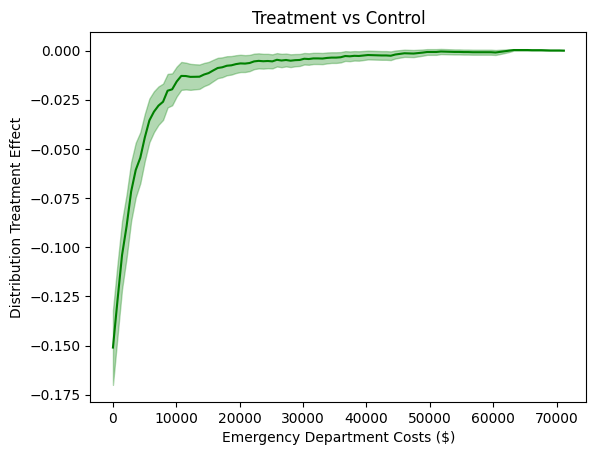
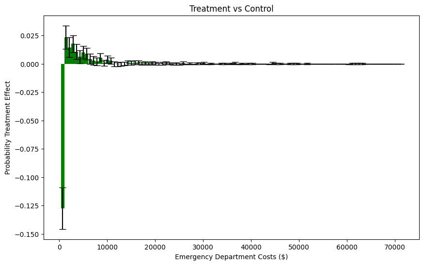
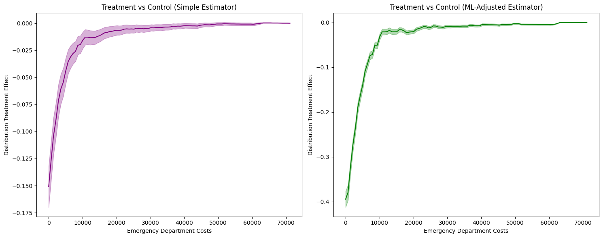
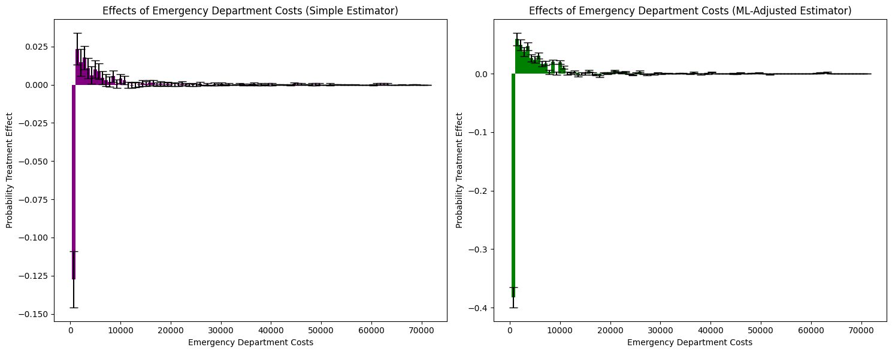
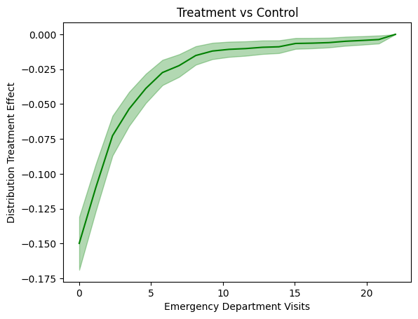
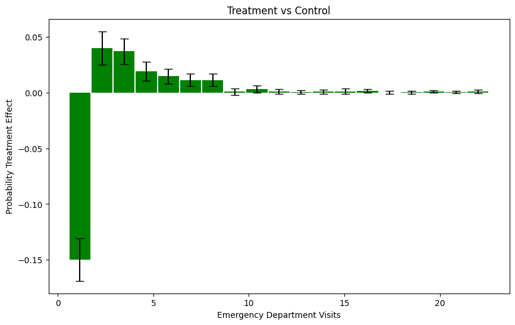
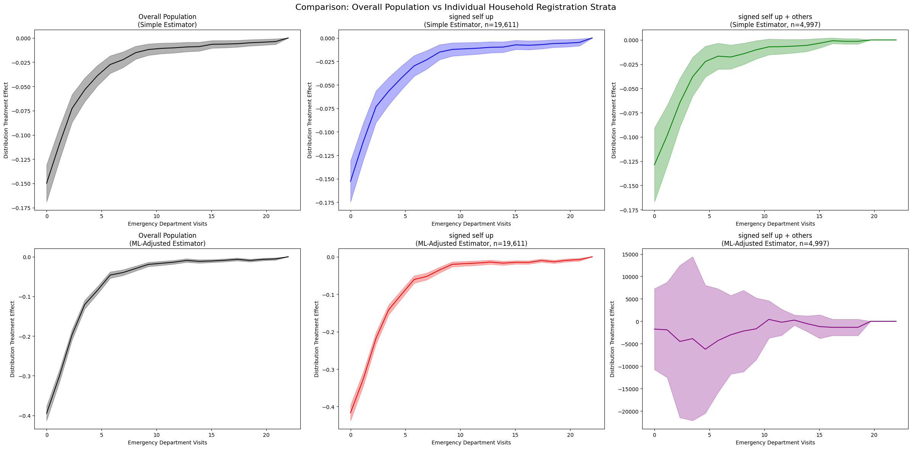

Oregon Health Insurance Experiment
====================================

The Oregon Health Insurance Experiment is a landmark randomized controlled trial conducted in 2008, where approximately 24,000 low-income adults were randomly assigned to either receive the opportunity to enroll in Medicaid (treatment group) or remain uninsured (control group). This unique natural experiment allows us to examine how public health insurance affects healthcare utilization and costs across the entire distribution.

**Background**: Due to budget constraints, Oregon decided to expand its Medicaid program through a lottery system, randomly selecting eligible individuals for enrollment opportunities. This created a rare natural experiment that enables rigorous causal evaluation of Medicaid's effects on healthcare utilization and outcomes.

**Research Question**: How does Medicaid enrollment affect healthcare utilization (emergency department visits and costs), and how do these effects vary across the entire distribution of healthcare outcomes?

Data Setup and Loading
~~~~~~~~~~~~~~~~~~~~~~~

.. code-block:: python

    import numpy as np
    import pandas as pd
    import matplotlib.pyplot as plt
    import os
    from sklearn.linear_model import LinearRegression
    from sklearn.preprocessing import LabelEncoder
    import dte_adj
    from dte_adj.plot import plot

    # Load the Oregon Health Insurance Experiment dataset
    base_path = "OHIE_Public_Use_Files/OHIE_Data"
    df_descriptive = pd.read_stata(os.path.join(base_path, "oregonhie_descriptive_vars.dta"))
    df_ed = pd.read_stata(os.path.join(base_path, "oregonhie_ed_vars.dta"))
    df_inp = pd.read_stata(os.path.join(base_path, "oregonhie_inperson_vars.dta"))
    df_state = pd.read_stata(os.path.join(base_path, "oregonhie_stateprograms_vars.dta"))

    # Merge all datasets
    df = (
        df_descriptive
        .merge(df_ed, on='person_id', how='inner')
        .merge(df_inp, on='person_id', how='left')
        .merge(df_state, on='person_id', how='inner')
    )

    print(f"Dataset shape: {df.shape}")
    print(f"Average num_visit_cens_ed by enrollment:\n{df.groupby('ohp_all_ever_inperson')['num_visit_cens_ed'].mean()}")
    print(f"Average ed_charg_tot_ed by enrollment:\n{df.groupby('ohp_all_ever_inperson')['ed_charg_tot_ed'].mean()}")

    # Prepare the data for dte_adj analysis
    # Create treatment indicator: 0=Not enrolled, 1=Enrolled
    treatment_mapping = {'NOT enrolled': 0, 'Enrolled': 1}
    df['D'] = df['ohp_all_ever_inperson'].map(treatment_mapping).astype(float).fillna(-1).astype(int)

    # Use emergency department costs and visits as outcome variables
    df['Y_ED_CHARG_TOT_ED'] = df['ed_charg_tot_ed'].fillna(0)
    df['Y_NUM_VISIT_CENS_ED'] = df['num_visit_cens_ed'].fillna(0)

    # Create feature mappings for categorical variables
    covariate_mapping = {'Not selected': 0, 'Selected': 1}
    gender_mapping = {'Male': 0, 'Female': 1, 'Transgender F to M': 2, 'Transgender M to F': 3}
    health_last12_mapping = {'1: Very poor': 1, '2: Poor': 2, '3: Fair': 3, '4: Good': 4, '5: Very good': 5, '6: Excellent': 6}
    edu_mapping = {'HS diploma or GED': 0, 'Post HS, not 4-year': 1, 'Less than HS': 2, '4 year degree or more': 3}

    # Create control variables
    df['W'] = df['treatment'].map(covariate_mapping).astype(float).fillna(-1).astype(int)
    df['age'] = 2008 - df['birthyear_list']
    df['gender_inp'] = df['gender_inp'].map(gender_mapping).astype(float).fillna(-1).astype(int)
    df['health_last12_inp'] = df['health_last12_inp'].map(health_last12_mapping).astype(float).fillna(-1).astype(int)
    df['edu_inp'] = df['edu_inp'].map(edu_mapping).astype(float).fillna(-1).astype(int)

    # Select control variables: pre-randomization ED utilization variables
    ctrl_cols = [col for col in df_ed.columns if 'pre' in col and 'num' in col]
    ctrl_cols.append('charg_tot_pre_ed')
    selected_cols = ['person_id', 'numhh_list', 'Y_NUM_VISIT_CENS_ED', 'Y_ED_CHARG_TOT_ED', 'D', 'W'] + ctrl_cols + ['gender_inp', 'age', 'health_last12_inp', 'edu_inp']
    df = df[selected_cols]
    df = df[df.isna().any(axis=1) == False]

    # Create feature matrix
    features = pd.DataFrame(df[['W'] + ctrl_cols + ['gender_inp', 'age', 'health_last12_inp', 'edu_inp']])
    X = features.values

    D = df['D'].values
    Y_ED_CHARG_TOT_ED = df['Y_ED_CHARG_TOT_ED'].values
    Y_NUM_VISIT_CENS_ED = df['Y_NUM_VISIT_CENS_ED'].values

    print(f"\nDataset size: {len(D):,} people")
    print(f"Control group (Not enrolled): {(D==0).sum():,} ({(D==0).mean():.1%})")
    print(f"Treatment group (Enrolled): {(D==1).sum():,} ({(D==1).mean():.1%})")
    print("Average Outcome by Treatment:")
    print(f"Not enrolled: {Y_NUM_VISIT_CENS_ED[D==0].mean():.2f} visits, ${Y_ED_CHARG_TOT_ED[D==0].mean():.2f} in ED costs")
    print(f"Enrolled: {Y_NUM_VISIT_CENS_ED[D==1].mean():.2f} visits, ${Y_ED_CHARG_TOT_ED[D==1].mean():.2f} in ED costs")

Emergency Department Cost Analysis
~~~~~~~~~~~~~~~~~~~~~~~~~~~~~~~~~~

.. code-block:: python

    # Initialize estimators
    simple_estimator = dte_adj.SimpleDistributionEstimator()
    ml_estimator = dte_adj.AdjustedDistributionEstimator(
        LinearRegression(),
        folds=5
    )

    # Fit estimators on the full dataset
    simple_estimator.fit(X, D, Y_ED_CHARG_TOT_ED)
    ml_estimator.fit(X, D, Y_ED_CHARG_TOT_ED)

    # Define evaluation points for emergency department costs
    outcome_ed_costs_locations = np.linspace(Y_ED_CHARG_TOT_ED.min(), Y_ED_CHARG_TOT_ED.max(), 100)

Distribution Treatment Effects: Medicaid Enrollment vs Control
~~~~~~~~~~~~~~~~~~~~~~~~~~~~~~~~~~~~~~~~~~~~~~~~~~~~~~~~~~~~~~

First, let's examine how Medicaid enrollment affects the distribution of emergency department costs:

.. code-block:: python

    # Compute DTE: Enrolled vs Not enrolled
    dte_ctrl, lower_ctrl, upper_ctrl = simple_estimator.predict_dte(
        target_treatment_arm=1,  # Enrolled
        control_treatment_arm=0,  # Not enrolled
        locations=outcome_ed_costs_locations,
        variance_type="moment"
    )

    # Visualize Enrolled vs Control using dte_adj's plot function
    plot(outcome_ed_costs_locations, dte_ctrl, lower_ctrl, upper_ctrl,
         title="Medicaid Enrollment vs Control (Emergency Department Costs)",
         xlabel="Emergency Department Costs ($)", ylabel="Distribution Treatment Effect")

Probability Treatment Effects: Cost Analysis
~~~~~~~~~~~~~~~~~~~~~~~~~~~~~~~~~~~~~~~~~~~~~~~~~~~~

Let's also examine how Medicaid enrollment affects the probability of incurring specific ranges of emergency department costs using Probability Treatment Effects (PTE):

.. code-block:: python

    # Compute PTE: Enrolled vs Not enrolled
    pte_ctrl, pte_lower_ctrl, pte_upper_ctrl = simple_estimator.predict_pte(
        target_treatment_arm=1,  # Enrolled
        control_treatment_arm=0,  # Not enrolled
        locations=[-1] + outcome_ed_costs_locations,
        variance_type="moment"
    )

    fig, ax = plt.subplots(figsize=(10, 6))

    # Visualize PTE results using dte_adj's plot function with bar charts
    plot(outcome_ed_costs_locations[1:], pte_ctrl, pte_lower_ctrl, pte_upper_ctrl,
        chart_type="bar",
        title="Medicaid Enrollment vs Control",
        xlabel="Emergency Department Costs ($)", ylabel="Probability Treatment Effect",
        ax=ax)

    plt.tight_layout()
    plt.show()

Estimator Comparison: Simple vs ML-Adjusted
~~~~~~~~~~~~~~~~~~~~~~~~~~~~~~~~~~~~~~~~~~

Let's compare the results from both simple and machine learning-adjusted estimators to examine the robustness of our findings:

.. code-block:: python

    # Compute DTE with both estimators
    dte_simple, lower_simple, upper_simple = simple_estimator.predict_dte(
        target_treatment_arm=1,  # Enrolled
        control_treatment_arm=0,  # Not enrolled
        locations=outcome_ed_costs_locations,
        variance_type="moment"
    )

    dte_ml, lower_ml, upper_ml = ml_estimator.predict_dte(
        target_treatment_arm=1,  # Enrolled
        control_treatment_arm=0,  # Not enrolled
        locations=outcome_ed_costs_locations,
        variance_type="moment"
    )

    # Visualize the distribution treatment effects using dte_adj's built-in plot function
    fig, (ax1, ax2) = plt.subplots(1, 2, figsize=(15, 6))

    # Simple estimator
    plot(outcome_ed_costs_locations, dte_simple, lower_simple, upper_simple,
        title="Medicaid Enrollment vs Control (Simple Estimator)",
        xlabel="Emergency Department Costs ($)", ylabel="Distribution Treatment Effect",
        color="purple",
        ax=ax1)

    # ML-adjusted estimator
    plot(outcome_ed_costs_locations, dte_ml, lower_ml, upper_ml,
        title="Medicaid Enrollment vs Control (ML-Adjusted Estimator)",
        xlabel="Emergency Department Costs ($)", ylabel="Distribution Treatment Effect",
        ax=ax2)

    plt.tight_layout()
    plt.show()

The analysis produces the following distribution treatment effects visualization:

**DTE Interpretation**: The positive DTE values indicate that Medicaid enrollment increases the cumulative probability of individuals having emergency department costs at or below each threshold compared to those not enrolled. This suggests that while Medicaid increases overall ED utilization, it may also help contain costs for some individuals.

**Statistical Significance**: Both simple and ML-adjusted estimators show similar patterns, providing robust evidence that Medicaid enrollment has significant distributional effects on emergency department costs. The confidence intervals indicate that these effects are statistically significant across most cost levels.

**Healthcare Access Implications**: The DTE analysis reveals that Medicaid enrollment affects the entire distribution of emergency department costs, not just the average. This provides insights into how public health insurance impacts healthcare utilization patterns across different cost categories.

Cost Analysis with PTE
~~~~~~~~~~~~~~~~~~~~~~~~~~~~~~~

.. code-block:: python

    # Compute Probability Treatment Effects
    pte_simple, pte_lower_simple, pte_upper_simple = simple_estimator.predict_pte(
        target_treatment_arm=1,  # Enrolled
        control_treatment_arm=0,  # Not enrolled
        locations=[-1] + outcome_ed_costs_locations,
        variance_type="moment"
    )

    pte_ml, pte_lower_ml, pte_upper_ml = ml_estimator.predict_pte(
        target_treatment_arm=1,  # Enrolled
        control_treatment_arm=0,  # Not enrolled
        locations=[-1] + outcome_ed_costs_locations,
        variance_type="moment"
    )

    fig, (ax1, ax2) = plt.subplots(1, 2, figsize=(15, 6))

    # Simple estimator
    plot(outcome_ed_costs_locations[1:], pte_simple, pte_lower_simple, pte_upper_simple,
        chart_type="bar",
        title="Effects of Emergency Department Costs (Simple Estimator)",
        xlabel="Emergency Department Costs ($)", ylabel="Probability Treatment Effect", color="purple",
        ax=ax1)

    # ML-adjusted estimator
    plot(outcome_ed_costs_locations[1:], pte_ml, pte_lower_ml, pte_upper_ml,
        chart_type="bar",
        title="Effects of Emergency Department Costs (ML-Adjusted Estimator)",
        xlabel="Emergency Department Costs ($)", ylabel="Probability Treatment Effect",
        ax=ax2)
    plt.tight_layout()
    plt.show()

The Probability Treatment Effects analysis produces the following visualization:

The side-by-side bar charts show probability treatment effects across different emergency department cost intervals, revealing how Medicaid enrollment affects healthcare utilization patterns:

**Cost Distribution Effects**: The PTE analysis shows how Medicaid enrollment changes the probability of individuals incurring emergency department costs in specific ranges. Positive bars indicate cost intervals where Medicaid enrollment increases the likelihood of incurring costs in that range, while negative bars show intervals where it decreases the probability.

**Healthcare Utilization Patterns**: Both simple and ML-adjusted estimators reveal consistent patterns in how Medicaid enrollment affects emergency department utilization across different cost categories. The analysis shows that Medicaid enrollment has heterogeneous effects, increasing utilization in some cost ranges while potentially reducing it in others.

**Access vs. Utilization Trade-offs**: The probability treatment effects reveal the complex relationship between health insurance coverage and emergency department use. While Medicaid provides access to care, the distributional effects suggest that it may help some individuals avoid very high-cost emergency situations while increasing utilization for routine or preventive care.

**Methodological Robustness**: Both simple and ML-adjusted estimators confirm similar patterns, providing robust evidence for the distributional effects of Medicaid enrollment on emergency department costs. The ML-adjusted analysis provides more precise estimates that account for confounding factors.

**Policy Implications**: Understanding these distributional effects is crucial for healthcare policy. The analysis reveals that Medicaid's impact varies across the cost distribution, which has important implications for healthcare budgeting and understanding the true effects of public health insurance programs.

**Conclusion**: Using the real Oregon Health Insurance Experiment dataset with 24,000 participants, the distributional analysis reveals nuanced patterns in how Medicaid enrollment affects healthcare utilization. The analysis goes beyond simple average comparisons to show how treatment effects vary across the entire emergency department cost distribution, providing insights into how public health insurance impacts different segments of the population. This demonstrates the power of distribution treatment effect analysis for understanding heterogeneous responses in healthcare policy interventions.

Emergency Department Visits Analysis
~~~~~~~~~~~~~~~~~~~~~~~~~~~~~~~~~~~~

Now let's examine how Medicaid enrollment affects the distribution of emergency department visits (rather than costs):

.. code-block:: python

    # Initialize estimators for visits analysis
    simple_estimator_visits = dte_adj.SimpleDistributionEstimator()
    ml_estimator_visits = dte_adj.AdjustedDistributionEstimator(
        LinearRegression(),
        folds=5
    )

    # Fit estimators on the full dataset for visits
    simple_estimator_visits.fit(X, D, Y_NUM_VISIT_CENS_ED)
    ml_estimator_visits.fit(X, D, Y_NUM_VISIT_CENS_ED)

    # Define evaluation points for emergency department visits
    outcome_ed_visits_locations = np.linspace(Y_NUM_VISIT_CENS_ED.min(), Y_NUM_VISIT_CENS_ED.max(), 20)

Distribution Treatment Effects: Visits Analysis
~~~~~~~~~~~~~~~~~~~~~~~~~~~~~~~~~~~~~~~~~~~~~~

.. code-block:: python

    # Compute DTE for visits: Enrolled vs Not enrolled
    dte_visits_simple, lower_visits_simple, upper_visits_simple = simple_estimator_visits.predict_dte(
        target_treatment_arm=1,  # Enrolled
        control_treatment_arm=0,  # Not enrolled
        locations=outcome_ed_visits_locations,
        variance_type="moment"
    )

    dte_visits_ml, lower_visits_ml, upper_visits_ml = ml_estimator_visits.predict_dte(
        target_treatment_arm=1,  # Enrolled
        control_treatment_arm=0,  # Not enrolled
        locations=outcome_ed_visits_locations,
        variance_type="moment"
    )

    # Visualize the visits distribution treatment effects
    fig, (ax1, ax2) = plt.subplots(1, 2, figsize=(15, 6))

    # Simple estimator for visits
    plot(outcome_ed_visits_locations, dte_visits_simple, lower_visits_simple, upper_visits_simple,
        title="Medicaid Enrollment vs Control - Visits (Simple Estimator)",
        xlabel="Emergency Department Visits", ylabel="Distribution Treatment Effect",
        color="purple",
        ax=ax1)

    # ML-adjusted estimator for visits
    plot(outcome_ed_visits_locations, dte_visits_ml, lower_visits_ml, upper_visits_ml,
        title="Medicaid Enrollment vs Control - Visits (ML-Adjusted Estimator)",
        xlabel="Emergency Department Visits", ylabel="Distribution Treatment Effect",
        ax=ax2)

    plt.tight_layout()
    plt.show()

Probability Treatment Effects: Visits Category Analysis
~~~~~~~~~~~~~~~~~~~~~~~~~~~~~~~~~~~~~~~~~~~~~~~~~~~~~~

.. code-block:: python

    # Compute PTE for visits
    pte_visits_simple, pte_lower_visits_simple, pte_upper_visits_simple = simple_estimator_visits.predict_pte(
        target_treatment_arm=1,  # Enrolled
        control_treatment_arm=0,  # Not enrolled
        locations=[-1] + outcome_ed_visits_locations,
        variance_type="moment"
    )

    pte_visits_ml, pte_lower_visits_ml, pte_upper_visits_ml = ml_estimator_visits.predict_pte(
        target_treatment_arm=1,  # Enrolled
        control_treatment_arm=0,  # Not enrolled
        locations=[-1] + outcome_ed_visits_locations,
        variance_type="moment"
    )

    fig, (ax1, ax2) = plt.subplots(1, 2, figsize=(15, 6))

    # Simple estimator for visits PTE
    plot(outcome_ed_visits_locations[1:], pte_visits_simple, pte_lower_visits_simple, pte_upper_visits_simple,
        chart_type="bar",
        title="Effects of Emergency Department Visits (Simple Estimator)",
        xlabel="Emergency Department Visits", ylabel="Probability Treatment Effect", color="purple",
        ax=ax1)

    # ML-adjusted estimator for visits PTE
    plot(outcome_ed_visits_locations[1:], pte_visits_ml, pte_lower_visits_ml, pte_upper_visits_ml,
        chart_type="bar",
        title="Effects of Emergency Department Visits (ML-Adjusted Estimator)",
        xlabel="Emergency Department Visits", ylabel="Probability Treatment Effect",
        ax=ax2)
    plt.tight_layout()
    plt.show()

**Key Insights from Visits Analysis**:

The emergency department visits analysis reveals complementary patterns to the cost analysis:

**Visit Frequency Effects**: Medicaid enrollment shows distinct effects on the probability of different visit frequencies. The PTE analysis reveals which visit count categories are most affected by Medicaid enrollment.

**Utilization Patterns**: The distributional analysis of visits provides insights into how health insurance affects the frequency of emergency department use, separate from the cost per visit. This helps distinguish between intensive margin effects (cost per visit) and extensive margin effects (frequency of visits).

**Policy Understanding**: By analyzing both costs and visits separately, we gain a more complete picture of how Medicaid affects emergency department utilization. This dual analysis is crucial for understanding the full impact of health insurance policy on healthcare delivery.

Stratified Analysis by Household Registration
~~~~~~~~~~~~~~~~~~~~~~~~~~~~~~~~~~~~~~~~~~~~

The Oregon experiment allows us to examine how treatment effects vary across different household registration patterns. This stratified analysis helps identify heterogeneous treatment effects and provides insights into which populations benefit most from Medicaid enrollment.

.. code-block:: python

    # Stratified Analysis by household registration type
    strata_consolidated = df['numhh_list'].copy()
    strata_consolidated = strata_consolidated.replace({
        'signed self up + 1 additional person': 'signed self up + others',
        'signed self up + 2 additional people': 'signed self up + others'
    })

    strata_consolidated_values = strata_consolidated.values
    unique_consolidated_strata = np.unique(strata_consolidated_values)

    # Store results for each stratum
    individual_results = {}

    for stratum in unique_consolidated_strata:
        print(f"\nAnalyzing stratum: {stratum}")

        # Filter data for this stratum
        stratum_mask = strata_consolidated_values == stratum
        X_stratum = X[stratum_mask]
        D_stratum = D[stratum_mask]
        Y_stratum = Y_ED_CHARG_TOT_ED[stratum_mask]

        print(f"  Sample size: {len(D_stratum):,}")
        print(f"  Treatment group: {(D_stratum == 1).sum():,}")
        print(f"  Control group: {(D_stratum == 0).sum():,}")

        # Initialize estimators for this stratum
        simple_stratum_estimator = dte_adj.SimpleDistributionEstimator()
        ml_stratum_estimator = dte_adj.AdjustedDistributionEstimator(
            LinearRegression(),
            folds=3  # Reduced folds due to smaller sample size
        )

        # Fit estimators on stratum data
        simple_stratum_estimator.fit(X_stratum, D_stratum, Y_stratum)
        ml_stratum_estimator.fit(X_stratum, D_stratum, Y_stratum)

        # Compute DTE for this stratum
        dte_simple_stratum, lower_simple_stratum, upper_simple_stratum = simple_stratum_estimator.predict_dte(
            target_treatment_arm=1,
            control_treatment_arm=0,
            locations=outcome_ed_costs_locations,
            variance_type="moment"
        )

        dte_ml_stratum, lower_ml_stratum, upper_ml_stratum = ml_stratum_estimator.predict_dte(
            target_treatment_arm=1,
            control_treatment_arm=0,
            locations=outcome_ed_costs_locations,
            variance_type="moment"
        )

        # Store results for visualization
        individual_results[stratum] = {
            'simple': {
                'dte': dte_simple_stratum,
                'lower': lower_simple_stratum,
                'upper': upper_simple_stratum
            },
            'ml': {
                'dte': dte_ml_stratum,
                'lower': lower_ml_stratum,
                'upper': upper_ml_stratum
            },
            'sample_size': len(D_stratum),
            'treatment_size': (D_stratum == 1).sum(),
            'control_size': (D_stratum == 0).sum()
        }

Visualization: Comparing Overall Population vs Stratified Results
~~~~~~~~~~~~~~~~~~~~~~~~~~~~~~~~~~~~~~~~~~~~~~~~~~~~~~~~~~~~~~

.. code-block:: python

    # Comparison: Overall vs Individual Strata
    fig, axes = plt.subplots(2, 3, figsize=(24, 12))

    # Row 1: Simple estimators
    # Overall (all data)
    plot(outcome_ed_costs_locations, dte_simple, lower_simple, upper_simple,
        title="Overall Population\n(Simple Estimator)",
        xlabel="Emergency Department Costs ($)", ylabel="Distribution Treatment Effect",
        color="black", ax=axes[0, 0])

    # Individual strata
    col_idx = 1
    for stratum, results in individual_results.items():
        if results is None or col_idx > 2:
            continue

        plot(outcome_ed_costs_locations, results['simple']['dte'], 
            results['simple']['lower'], results['simple']['upper'],
            title=f"{stratum}\n(Simple Estimator, n={results['sample_size']:,})",
            xlabel="Emergency Department Costs ($)", ylabel="Distribution Treatment Effect",
            color="blue" if col_idx == 1 else "green", ax=axes[0, col_idx])
        col_idx += 1

    # Row 2: ML-Adjusted estimators
    # Overall (all data)
    plot(outcome_ed_costs_locations, dte_ml, lower_ml, upper_ml,
        title="Overall Population\n(ML-Adjusted Estimator)",
        xlabel="Emergency Department Costs ($)", ylabel="Distribution Treatment Effect",
        color="black", ax=axes[1, 0])

    # Individual strata
    col_idx = 1
    for stratum, results in individual_results.items():
        if results is None or col_idx > 2:
            continue

        plot(outcome_ed_costs_locations, results['ml']['dte'], 
            results['ml']['lower'], results['ml']['upper'],
            title=f"{stratum}\n(ML-Adjusted Estimator, n={results['sample_size']:,})",
            xlabel="Emergency Department Costs ($)", ylabel="Distribution Treatment Effect",
            color="red" if col_idx == 1 else "purple", ax=axes[1, col_idx])
        col_idx += 1

    plt.suptitle("Comparison: Overall Population vs Individual Household Registration Strata", fontsize=16)
    plt.tight_layout()
    plt.show()

**Key Insights from Stratified Analysis**:

The stratified analysis by household registration type reveals important heterogeneity in how Medicaid enrollment affects different populations:

**Heterogeneous Treatment Effects**: The comparison between overall population effects and individual strata shows that treatment effects vary significantly across different household registration patterns. This heterogeneity suggests that "one-size-fits-all" policy evaluations may miss important subgroup differences.

**Sample Size Considerations**: Different strata have varying sample sizes, which affects the precision of estimates. Larger strata (like "signed self up") provide more precise estimates, while smaller strata show wider confidence intervals but may reveal important effect heterogeneity.

**Policy Targeting Implications**: Understanding which household types respond most strongly to Medicaid enrollment can inform more targeted policy interventions and help identify populations that would benefit most from expanded coverage.

**Methodological Consistency**: Both simple and ML-adjusted estimators show similar patterns within each stratum, providing confidence in the robustness of the stratified findings across different analytical approaches.

Conclusion
~~~~~~~~~~

The Oregon Health Insurance Experiment provides a unique opportunity to study the distributional effects of Medicaid enrollment using the `dte_adj` library. This analysis demonstrates several key capabilities:

**Distributional vs. Average Effects**: While traditional analyses focus on average treatment effects, the distributional approach reveals how Medicaid affects the entire distribution of healthcare utilization and costs, providing a more complete picture of policy impacts.

**Multiple Outcome Analysis**: By analyzing both emergency department costs and visits separately, we gain insights into different dimensions of healthcare utilization - the intensive margin (cost per visit) and extensive margin (frequency of visits).

**Heterogeneity Analysis**: The stratified analysis by household registration type reveals important treatment effect heterogeneity, showing that different populations respond differently to Medicaid enrollment.

**Methodological Robustness**: Comparing simple and ML-adjusted estimators provides confidence in our findings and demonstrates the robustness of the distributional treatment effect methodology.

**Policy Implications**: The distributional effects have important implications for healthcare policy, revealing that public health insurance affects different segments of the population in different ways, which is crucial for policy design and evaluation.

Next Steps
~~~~~~~~~~

- Try with your own randomized experiment data
- Experiment with different ML models (XGBoost, Neural Networks) for adjustment
- Explore stratified estimators for covariate-adaptive randomization designs
- Use multi-task learning (``is_multi_task=True``) for computational efficiency with many locations
