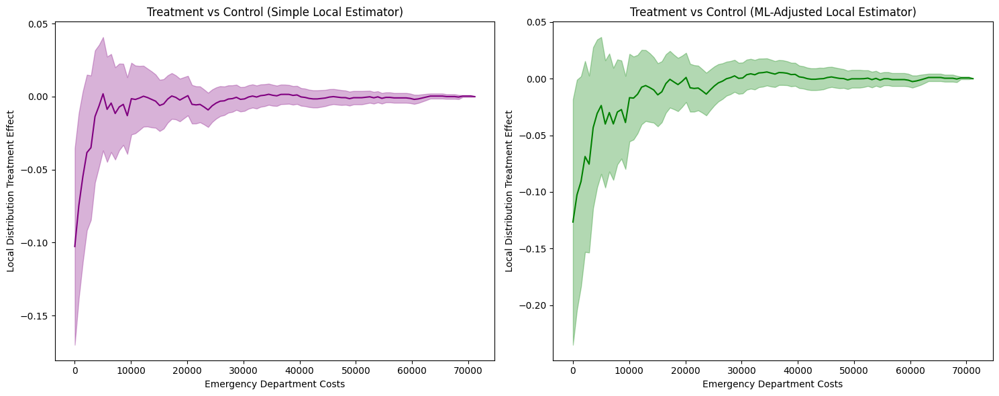
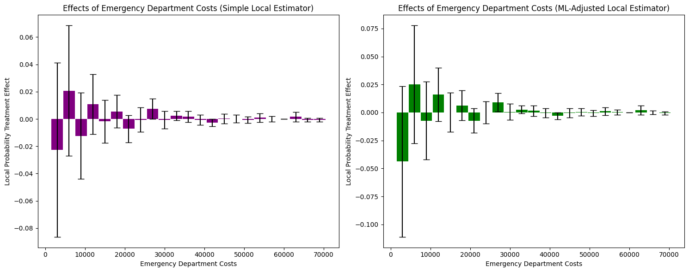
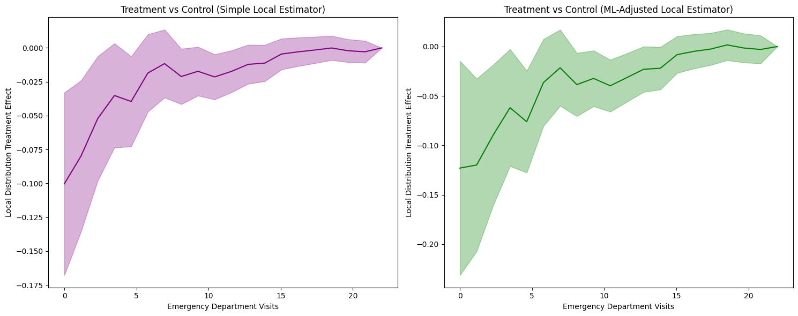
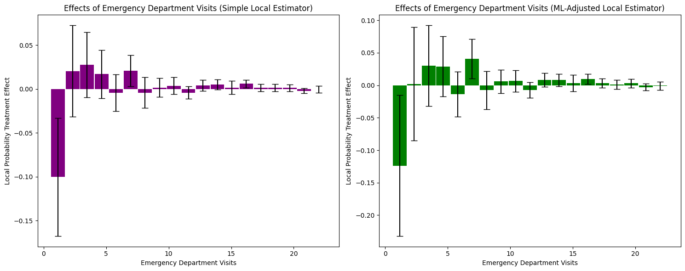
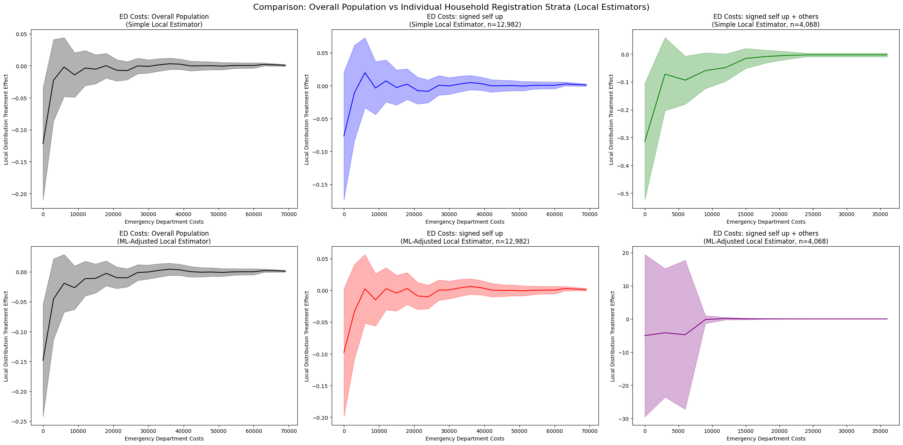

Oregon Health Insurance Experiment
====================================

The Oregon Health Insurance Experiment is a landmark randomized controlled trial conducted in 2008, where approximately 24,000 low-income adults were randomly assigned to either receive the opportunity to enroll in Medicaid (treatment group) or remain uninsured (control group). This unique natural experiment allows us to examine how public health insurance affects healthcare utilization and costs across the entire distribution.

**Background**: Due to budget constraints, Oregon decided to expand its Medicaid program through a lottery system, randomly selecting eligible individuals for enrollment opportunities. This created a rare natural experiment with non-compliance (not all selected individuals enrolled) that enables rigorous causal evaluation using Local Distribution Treatment Effects (LDTE) methodology.

**Research Question**: How does Medicaid assignment (and enrollment) affect healthcare utilization (emergency department visits and costs), accounting for non-compliance, and how do these effects vary across the entire distribution of healthcare outcomes?

Data Setup and Loading
~~~~~~~~~~~~~~~~~~~~~~~

**Data Source**: The Oregon Health Insurance Experiment data used in this tutorial is publicly available through the National Bureau of Economic Research (NBER). You can download the dataset from the official NBER Public Use Data Archive at: https://www.nber.org/research/data/oregon-health-insurance-experiment-data

The dataset includes multiple files containing information about participants in the experiment:

- ``oregonhie_descriptive_vars.dta``: Demographic and baseline characteristics
- ``oregonhie_ed_vars.dta``: Emergency department utilization data
- ``oregonhie_inperson_vars.dta``: In-person survey responses
- ``oregonhie_stateprograms_vars.dta``: State program participation data

This data supports research on how health insurance affects healthcare utilization and is maintained by researchers Amy Finkelstein and Katherine Baicker. Please ensure you comply with the data use agreements when downloading and using this dataset.

Import Libraries
^^^^^^^^^^^^^^^^

First, we import the necessary libraries for data processing, analysis, and visualization:

.. code-block:: python

    import numpy as np
    import pandas as pd
    import matplotlib.pyplot as plt
    import os
    from sklearn.linear_model import LinearRegression
    from sklearn.preprocessing import LabelEncoder
    import dte_adj
    from dte_adj.plot import plot

Load and Merge Datasets
^^^^^^^^^^^^^^^^^^^^^^^^

Next, we load the four separate data files and merge them into a single dataset:

.. code-block:: python

    # Load the Oregon Health Insurance Experiment dataset
    base_path = "OHIE_Public_Use_Files/OHIE_Data"
    df_descriptive = pd.read_stata(os.path.join(base_path, "oregonhie_descriptive_vars.dta"))
    df_ed = pd.read_stata(os.path.join(base_path, "oregonhie_ed_vars.dta"))
    df_inp = pd.read_stata(os.path.join(base_path, "oregonhie_inperson_vars.dta"))
    df_state = pd.read_stata(os.path.join(base_path, "oregonhie_stateprograms_vars.dta"))

    # Merge all datasets
    df = (
        df_descriptive
        .merge(df_ed, on='person_id', how='inner')
        .merge(df_inp, on='person_id', how='left')
        .merge(df_state, on='person_id', how='inner')
    )

    print(f"Dataset shape: {df.shape}")
    print(f"Average num_visit_cens_ed by enrollment:\n{df.groupby('ohp_all_ever_inperson')['num_visit_cens_ed'].mean()}")
    print(f"Average ed_charg_tot_ed by enrollment:\n{df.groupby('ohp_all_ever_inperson')['ed_charg_tot_ed'].mean()}")

Data Preprocessing
^^^^^^^^^^^^^^^^^^

Next, we prepare the data for the DTE analysis. This involves creating treatment variables, encoding categorical features, and selecting control variables:

.. code-block:: python

    # Create treatment assignment (instrumental variable): 0=Not selected, 1=Selected
    treatment_assignment_mapping = {'Not selected': 0, 'Selected': 1}
    df['Z'] = df['treatment'].map(treatment_assignment_mapping)

    # Create actual treatment indicator: 0=Not enrolled, 1=Enrolled, -1=Missing
    treatment_mapping = {'NOT enrolled': 0, 'Enrolled': 1}
    df['D'] = df['ohp_all_ever_inperson'].map(treatment_mapping)

    # Create strata based on household size
    df.rename(columns={'numhh_list': 'strata'}, inplace=True)
    df['strata'] = df['strata'].replace({
        'signed self up + 1 additional person': 'signed self up + others',
        'signed self up + 2 additional people': 'signed self up + others'
    })

    # Create feature mappings for categorical variables
    gender_mapping = {'Male': 0, 'Female': 1, 'Transgender F to M': 2, 'Transgender M to F': 3}
    health_last12_mapping = {'1: Very poor': 1, '2: Poor': 2, '3: Fair': 3, '4: Good': 4, '5: Very good': 5, '6: Excellent': 6}
    edu_mapping = {'HS diploma or GED': 0, 'Post HS, not 4-year': 1, 'Less than HS': 2, '4 year degree or more': 3}

    df['age'] = 2008 - df['birthyear_list']
    df['gender_inp'] = df['gender_inp'].map(gender_mapping).astype(float).fillna(-1).astype(int)
    df['health_last12_inp'] = df['health_last12_inp'].map(health_last12_mapping).astype(float).fillna(-1).astype(int)
    df['edu_inp'] = df['edu_inp'].map(edu_mapping).astype(float).fillna(-1).astype(int)

    # Select control variables: pre-randomization ED utilization variables
    ctrl_cols = [col for col in df_ed.columns if 'pre' in col and 'num' in col] + ['gender_inp', 'age', 'health_last12_inp', 'edu_inp', 'charg_tot_pre_ed']
    selected_cols = ['person_id', 'strata', 'ed_charg_tot_ed', 'num_visit_cens_ed', 'Z', 'D'] + ctrl_cols
    df = df[selected_cols]
    df = df.dropna().reset_index(drop=True)

Prepare Variables for Analysis
^^^^^^^^^^^^^^^^^^^^^^^^^^^^^^^

Finally, we create the feature matrices and outcome variables needed for the Local Distribution Treatment Effect analysis:

.. code-block:: python

    # Create feature matrix (excluding treatment variables)
    X = df[ctrl_cols].values

    Z = df['Z'].astype(int).values  # Treatment assignment (instrumental variable)
    D = df['D'].astype(int).values  # Actual treatment (endogenous variable)
    strata = df['strata'].values  # Stratification variable

    # Use num_visit_cens_ed and ed_charg_tot_ed as outcome variables
    Y_ED_CHARG_TOT_ED = df['ed_charg_tot_ed'].values
    Y_NUM_VISIT_CENS_ED = df['num_visit_cens_ed'].values

    print(f"\nDataset size: {len(D):,} people")
    print(f"Treatment assignment (Z) - Not selected: {(Z==0).sum():,} ({(Z==0).mean():.1%})")
    print(f"Treatment assignment (Z) - Selected: {(Z==1).sum():,} ({(Z==1).mean():.1%})")
    print(f"Actual treatment (D) - Not enrolled: {(D==0).sum():,} ({(D==0).mean():.1%})")
    print(f"Actual treatment (D) - Enrolled: {(D==1).sum():,} ({(D==1).mean():.1%})")
    print("\nCompliance rate (among those assigned to treatment):")
    print(f"Compliance rate: {(D[Z==1]==1).mean():.1%}")
    print("\nAverage Outcome by Actual Treatment (D):")
    print(f"Not enrolled (D=0): {Y_NUM_VISIT_CENS_ED[D==0].mean():.2f} visits, ${Y_ED_CHARG_TOT_ED[D==0].mean():.2f} in ED costs")
    print(f"Enrolled (D=1): {Y_NUM_VISIT_CENS_ED[D==1].mean():.2f} visits, ${Y_ED_CHARG_TOT_ED[D==1].mean():.2f} in ED costs")

Emergency Department Cost Analysis
~~~~~~~~~~~~~~~~~~~~~~~~~~~~~~~~~~

.. code-block:: python

    # Initialize LOCAL estimators for non-compliance scenario
    simple_local_estimator = dte_adj.SimpleLocalDistributionEstimator()
    ml_local_estimator = dte_adj.AdjustedLocalDistributionEstimator(
        LinearRegression(),
        folds=5
    )

    # Fit estimators: fit(covariates, treatment_arms, treatment_indicator, outcomes, strata)
    # treatment_arms = Z (Treatment assignment), treatment_indicator = D (Actual treatment)
    simple_local_estimator.fit(X, Z, D, Y_ED_CHARG_TOT_ED, strata)
    ml_local_estimator.fit(X, Z, D, Y_ED_CHARG_TOT_ED, strata)

    # Define evaluation points for emergency department costs
    outcome_ed_costs_locations = np.arange(Y_ED_CHARG_TOT_ED.min(), Y_ED_CHARG_TOT_ED.max(), 3000)

Local Estimator Comparison: Simple vs ML-Adjusted (Costs)
~~~~~~~~~~~~~~~~~~~~~~~~~~~~~~~~~~~~~~~~~~~~~~~~~~~~~~~~~

Let's compare the results from both simple and machine learning-adjusted local estimators to examine the robustness of our findings:

.. code-block:: python

    # Compute LDTE: Treatment vs Control
    ldte_simple, lower_simple, upper_simple = simple_local_estimator.predict_ldte(
        target_treatment_arm=1,  # Z=1 Selected for treatment (Enrolled)
        control_treatment_arm=0,  # Z=0 Not selected for treatment (Not enrolled)
        locations=outcome_ed_costs_locations
    )

    ldte_ml, lower_ml, upper_ml = ml_local_estimator.predict_ldte(
        target_treatment_arm=1,  # Selected for treatment (Enrolled)
        control_treatment_arm=0,  # Not selected for treatment (Not enrolled)
        locations=outcome_ed_costs_locations
    )

    # Visualize the distribution treatment effects using dte_adj's built-in plot function
    fig, (ax1, ax2) = plt.subplots(1, 2, figsize=(15, 6))

    # Visualize Treatment vs Control using dte_adj's plot function
    plot(outcome_ed_costs_locations, ldte_simple, lower_simple, upper_simple,
         title="ED Costs: Treatment vs Control (Simple Local Estimator)",
         xlabel="Emergency Department Costs",
         ylabel="Local Distribution Treatment Effect",
         color="purple",
         ax=ax1)

    plot(outcome_ed_costs_locations, ldte_ml, lower_ml, upper_ml,
         title="ED Costs: Treatment vs Control (ML-Adjusted Local Estimator)",
         xlabel="Emergency Department Costs",
         ylabel="Local Distribution Treatment Effect",
         ax=ax2)

    plt.tight_layout()
    plt.show()

The analysis produces the following local distribution treatment effects visualization:

**1. LDTE Interpretation and Distribution-Level Insights**

- **Simple Local Estimator**: Shows LDTE ≈ -0.12 at zero costs, meaning 12 percentage points fewer insured individuals have zero ED costs. The effect converges to zero around $10,000 and remains flat thereafter.
- **ML-Adjusted Local Estimator**: Shows a smaller effect of LDTE ≈ -0.15 at zero costs, with similar convergence patterns.
- **Key Finding**: Both estimators reveal insurance primarily affects the lower tail (zero to ~$10,000), shifting the distribution rightward. This indicates insurance increases ED access among those who would otherwise not seek care, while having minimal impact on high-cost users.

**2. Covariate Adjustment Effects and Confidence Intervals**

The confidence intervals are not substantially narrower with ML adjustment. Both methods show comparably wide confidence bands, indicating limited efficiency gains. This suggests: (1) covariates have limited predictive power for ED costs, (2) the linear regression model may be too simple, or (3) the simple estimator is already reasonably efficient.

Cost Analysis with Local PTE
~~~~~~~~~~~~~~~~~~~~~~~~~~~~~

.. code-block:: python

    # Compute Local Probability Treatment Effects
    lpte_simple, lpte_lower_simple, lpte_upper_simple = simple_local_estimator.predict_lpte(
        target_treatment_arm=1,  # Z=1 Selected for treatment (Enrolled)
        control_treatment_arm=0,  # Z=0 Not selected for treatment (Not enrolled)
        locations=[-1] + outcome_ed_costs_locations
    )

    lpte_ml, lpte_lower_ml, lpte_upper_ml = ml_local_estimator.predict_lpte(
        target_treatment_arm=1,  # Z=1 Selected for treatment (Enrolled)
        control_treatment_arm=0,  # Z=0 Not selected for treatment (Not enrolled)
        locations=[-1] + outcome_ed_costs_locations
    )

    fig, (ax1, ax2) = plt.subplots(1, 2, figsize=(15, 6))

    # Simple local estimator
    plot(outcome_ed_costs_locations[1:], lpte_simple, lpte_lower_simple, lpte_upper_simple,
        chart_type="bar",
        title="Effects of Emergency Department Costs (Simple Local Estimator)",
        xlabel="Emergency Department Costs",
        ylabel="Local Probability Treatment Effect",
        color="purple",
        ax=ax1)

    # ML-adjusted local estimator
    plot(outcome_ed_costs_locations[1:], lpte_ml, lpte_lower_ml, lpte_upper_ml,
        chart_type="bar",
        title="Effects of Emergency Department Costs (ML-Adjusted Local Estimator)",
        xlabel="Emergency Department Costs",
        ylabel="Local Probability Treatment Effect",
        ax=ax2)
    plt.tight_layout()
    plt.show()

The Local Probability Treatment Effects analysis produces the following visualization:

**1. LPTE Interpretation and Distribution-Level Insights**

- **Simple Local Estimator**: Shows mixed effects across cost bins. At zero costs, LPTE ≈ -0.02 (not statistically significant given wide confidence intervals). Small positive effects appear in the $5,000-$10,000 range (LPTE ≈ 0.01-0.02), converging to zero beyond $30,000.
- **ML-Adjusted Local Estimator**: Shows a larger negative effect at zero costs (LPTE ≈ -0.04) and positive effects in the $5,000-$15,000 range (LPTE ≈ 0.01-0.02). Effects converge to zero at higher costs.
- **Key Finding**: Insurance reduces the probability mass at zero costs while increasing it in the moderate cost range ($5,000-$15,000). This represents a redistribution of probability mass from non-users to moderate ED cost users, with minimal effect on high-cost outliers.

**2. Covariate Adjustment Effects and Confidence Intervals**

The confidence intervals remain wide for both estimators, though ML adjustment shows slightly more consistent patterns in the moderate cost range. The limited precision suggests: (1) substantial heterogeneity in treatment effects within cost bins, (2) limited predictive power of covariates for specific cost levels, or (3) relatively small sample sizes within individual bins.

Emergency Department Visits Analysis
~~~~~~~~~~~~~~~~~~~~~~~~~~~~~~~~~~~~

Now let's examine how Medicaid enrollment affects the distribution of emergency department visits (rather than costs):

.. code-block:: python

    # Initialize local estimators for visits analysis
    simple_local_estimator = dte_adj.SimpleLocalDistributionEstimator()
    ml_local_estimator = dte_adj.AdjustedLocalDistributionEstimator(
        LinearRegression(),
        folds=5
    )

    # Fit local estimators on the full dataset
    # Parameters: X, treatment_arms, treatment_indicator, outcomes, strata
    simple_local_estimator.fit(X, Z, D, Y_NUM_VISIT_CENS_ED, strata)
    ml_local_estimator.fit(X, Z, D, Y_NUM_VISIT_CENS_ED, strata)

    # Define evaluation points for emergency department visits
    outcome_ed_visits_locations = np.arange(Y_NUM_VISIT_CENS_ED.min(), Y_NUM_VISIT_CENS_ED.max(), 1)

Local Estimator Comparison: Simple vs ML-Adjusted (Visits)
~~~~~~~~~~~~~~~~~~~~~~~~~~~~~~~~~~~~~~~~~~~~~~~~~~~~~~~~~

Let's compare the results from both simple and machine learning-adjusted local estimators for visits analysis:

.. code-block:: python

    # Compute LDTE: Treatment vs Control
    ldte_simple, lower_simple, upper_simple = simple_local_estimator.predict_ldte(
        target_treatment_arm=1,  # Z=1 Selected for treatment (Enrolled)
        control_treatment_arm=0,  # Z=0 Not selected for treatment (Not enrolled)
        locations=outcome_ed_visits_locations
    )

    ldte_ml, lower_ml, upper_ml = ml_local_estimator.predict_ldte(
        target_treatment_arm=1,  # Selected for treatment (Enrolled)
        control_treatment_arm=0,  # Not selected for treatment (Not enrolled)
        locations=outcome_ed_visits_locations
    )

    # Visualize the local distribution treatment effects using dte_adj's built-in plot function
    fig, (ax1, ax2) = plt.subplots(1, 2, figsize=(15, 6))

    # Visualize Treatment vs Control using dte_adj's plot function
    plot(outcome_ed_visits_locations, ldte_simple, lower_simple, upper_simple,
         title="ED Visits: Treatment vs Control (Simple Local Estimator)",
         xlabel="Emergency Department Visits",
         ylabel="Local Distribution Treatment Effect",
         color="purple",
         ax=ax1)

    plot(outcome_ed_visits_locations, ldte_ml, lower_ml, upper_ml,
         title="ED Visits: Treatment vs Control (ML-Adjusted Local Estimator)",
         xlabel="Emergency Department Visits",
         ylabel="Local Distribution Treatment Effect",
         ax=ax2)

    plt.tight_layout()
    plt.show()

**1. LDTE Interpretation and Distribution-Level Insights**

- **Simple Local Estimator**: Shows LDTE ≈ -0.12 at zero visits, meaning 12 percentage points fewer insured individuals have zero ED visits. The effect gradually converges toward zero around 16 visits and remains near zero thereafter.
- **ML-Adjusted Local Estimator**: Shows a smaller effect of LDTE ≈ -0.15 at zero visits, with similar convergence patterns.
- **Key Finding**: Both estimators reveal insurance primarily affects the lower tail (zero to ~7 visits), shifting the distribution rightward. This indicates insurance increases ED utilization among those who would otherwise not visit, while having minimal impact on frequent ED users.

**2. Covariate Adjustment Effects and Confidence Intervals**

The confidence intervals are not substantially narrower with ML adjustment. Both methods show comparably wide confidence bands, indicating limited efficiency gains. This suggests: (1) covariates have limited predictive power for ED visit frequency, (2) the linear regression model may be too simple, or (3) the simple estimator is already reasonably efficient.

Visits Analysis with Local PTE
~~~~~~~~~~~~~~~~~~~~~~~~~~~~~~~

.. code-block:: python

    # Compute Local Probability Treatment Effects
    lpte_simple, lpte_lower_simple, lpte_upper_simple = simple_local_estimator.predict_lpte(
        target_treatment_arm=1,  # Z=1 Selected for treatment (Enrolled)
        control_treatment_arm=0,  # Z=0 Not selected for treatment (Not enrolled)
        locations=[-1] + outcome_ed_visits_locations
    )

    lpte_ml, lpte_lower_ml, lpte_upper_ml = ml_local_estimator.predict_lpte(
        target_treatment_arm=1,  # Z=1 Selected for treatment (Enrolled)
        control_treatment_arm=0,  # Z=0 Not selected for treatment (Not enrolled)
        locations=[-1] + outcome_ed_visits_locations
    )

    fig, (ax1, ax2) = plt.subplots(1, 2, figsize=(15, 6))

    # Simple local estimator
    plot(outcome_ed_visits_locations[1:], lpte_simple, lpte_lower_simple, lpte_upper_simple,
        chart_type="bar",
        title="Effects of Emergency Department Visits (Simple Local Estimator)",
        xlabel="Emergency Department Visits",
        ylabel="Local Probability Treatment Effect",
        color="purple",
        ax=ax1)

    # ML-adjusted local estimator
    plot(outcome_ed_visits_locations[1:], lpte_ml, lpte_lower_ml, lpte_upper_ml,
        chart_type="bar",
        title="Effects of Emergency Department Visits (ML-Adjusted Local Estimator)",
        xlabel="Emergency Department Visits",
        ylabel="Local Probability Treatment Effect",
        ax=ax2)

    plt.tight_layout()
    plt.show()

**1. LPTE Interpretation and Distribution-Level Insights**

- **Simple Local Estimator**: Shows a large negative effect at zero visits (LPTE ≈ -0.12), indicating 12 percentage points fewer insured individuals have zero ED visits. Small positive effects appear in the 1-5 visit range (LPTE ≈ 0.02-0.03), converging to zero beyond 7 visits.
- **ML-Adjusted Local Estimator**: Shows a larger negative effect at zero visits (LPTE ≈ -0.14) and positive effects in the 1-5 visit range (LPTE ≈ 0.03-0.04). Effects converge to zero at higher visit frequencies.
- **Key Finding**: Insurance reduces the probability mass at zero visits while increasing it in the low-to-moderate visit range (1-5 visits). This represents a redistribution of probability mass from non-users to low-frequency ED users, with minimal effect on frequent visitors.

**2. Covariate Adjustment Effects and Confidence Intervals**

The confidence intervals remain wide for both estimators, particularly at zero and low visit counts. The limited precision suggests: (1) substantial heterogeneity in treatment effects within visit frequency bins, (2) limited predictive power of covariates for specific visit levels, or (3) relatively small sample sizes within individual bins.

Stratified Analysis by Household Registration
~~~~~~~~~~~~~~~~~~~~~~~~~~~~~~~~~~~~~~~~~~~~

The Oregon experiment allows us to examine how treatment effects vary across different household registration patterns. This stratified analysis helps identify heterogeneous treatment effects and provides insights into which populations benefit most from Medicaid enrollment.

.. code-block:: python

    # Individual Stratum Analysis with Local Estimators
    print("\n=== Individual Stratum Analysis (Local Estimators) ===")

    # Get strata values (already consolidated in preprocessing)
    strata_consolidated_values = df['strata'].values
    unique_consolidated_strata = np.unique(strata_consolidated_values)

    # Individual estimations for each stratum
    individual_results = {}

    for stratum in unique_consolidated_strata:
        print(f"\nAnalyzing stratum: {stratum}")

        # Filter data for this stratum
        stratum_mask = strata_consolidated_values == stratum
        X_stratum = X[stratum_mask]
        treatment_arms_stratum = Z[stratum_mask]
        treatment_indicator_stratum = D[stratum_mask]
        Y_stratum = Y_ED_CHARG_TOT_ED[stratum_mask]

        # Create uniform strata for this subset (all observations in same stratum)
        strata_stratum = np.zeros(len(X_stratum), dtype=int)

        print(f"  Sample size: {len(treatment_indicator_stratum):,}")
        print(f"  Treatment assignment (Selected): {(treatment_arms_stratum == 1).sum():,}")
        print(f"  Treatment indicator (Enrolled): {(treatment_indicator_stratum == 1).sum():,}")

        # Initialize local estimators for this stratum
        simple_stratum_estimator = dte_adj.SimpleLocalDistributionEstimator()
        ml_stratum_estimator = dte_adj.AdjustedLocalDistributionEstimator(
            LinearRegression(),
            folds=3  # Reduced folds due to smaller sample size
        )

        # Fit estimators on stratum data
        simple_stratum_estimator.fit(X_stratum, treatment_arms_stratum, treatment_indicator_stratum, Y_stratum, strata_stratum)
        ml_stratum_estimator.fit(X_stratum, treatment_arms_stratum, treatment_indicator_stratum, Y_stratum, strata_stratum)

        # Define locations for this stratum based on its data range
        outcome_ed_costs_locations_stratum = np.arange(Y_stratum.min(), Y_stratum.max(), 3000)

        # Compute LDTE for this stratum using stratum-specific locations
        ldte_simple_stratum, lower_simple_stratum, upper_simple_stratum = simple_stratum_estimator.predict_ldte(
            target_treatment_arm=1,
            control_treatment_arm=0,
            locations=outcome_ed_costs_locations_stratum
        )

        ldte_ml_stratum, lower_ml_stratum, upper_ml_stratum = ml_stratum_estimator.predict_ldte(
            target_treatment_arm=1,
            control_treatment_arm=0,
            locations=outcome_ed_costs_locations_stratum
        )

        # Store results including the locations
        individual_results[stratum] = {
            'simple': {
                'ldte': ldte_simple_stratum,
                'lower': lower_simple_stratum,
                'upper': upper_simple_stratum
            },
            'ml': {
                'ldte': ldte_ml_stratum,
                'lower': lower_ml_stratum,
                'upper': upper_ml_stratum
            },
            'locations': outcome_ed_costs_locations_stratum,
            'sample_size': len(treatment_indicator_stratum),
            'treatment_assignment_size': (treatment_arms_stratum == 1).sum(),
            'treatment_indicator_size': (treatment_indicator_stratum == 1).sum()
        }

Visualization: Comparing Overall Population vs Stratified Results
~~~~~~~~~~~~~~~~~~~~~~~~~~~~~~~~~~~~~~~~~~~~~~~~~~~~~~~~~~~~~~

.. code-block:: python

    # Comparison: Overall vs Individual Strata (Local Estimators)
    fig, axes = plt.subplots(2, 3, figsize=(24, 12))

    # Row 1: Simple local estimators
    # Overall (all data)
    plot(outcome_ed_costs_locations, ldte_simple, lower_simple, upper_simple,
            title="ED Costs: Overall Population\n(Simple Local Estimator)",
            xlabel="Emergency Department Costs",
            ylabel="Local Distribution Treatment Effect",
            color="black", ax=axes[0, 0])

    # Individual strata
    col_idx = 1
    for stratum, results in individual_results.items():
        if results is None or col_idx > 2:
            continue

        plot(results['locations'], results['simple']['ldte'],
                results['simple']['lower'], results['simple']['upper'],
                title=f"ED Costs: {stratum}\n(Simple Local Estimator, n={results['sample_size']:,})",
                xlabel="Emergency Department Costs",
                ylabel="Local Distribution Treatment Effect",
                color="blue" if col_idx == 1 else "green", ax=axes[0, col_idx])
        col_idx += 1

    # Row 2: ML-Adjusted local estimators
    # Overall (all data)
    plot(outcome_ed_costs_locations, ldte_ml, lower_ml, upper_ml,
            title="ED Costs: Overall Population\n(ML-Adjusted Local Estimator)",
            xlabel="Emergency Department Costs",
            ylabel="Local Distribution Treatment Effect",
            color="black", ax=axes[1, 0])

    # Individual strata
    col_idx = 1
    for stratum, results in individual_results.items():
        if results is None or col_idx > 2:
            continue

        plot(results['locations'], results['ml']['ldte'],
                results['ml']['lower'], results['ml']['upper'],
                title=f"ED Costs: {stratum}\n(ML-Adjusted Local Estimator, n={results['sample_size']:,})",
                xlabel="Emergency Department Costs",
                ylabel="Local Distribution Treatment Effect",
                color="red" if col_idx == 1 else "purple", ax=axes[1, col_idx])
        col_idx += 1

    plt.suptitle("Comparison: Overall Population vs Individual Household Registration Strata (Local Estimators)", fontsize=16)
    plt.tight_layout()
    plt.show()

**1. Overall Population vs Stratified Analysis**

- **Overall Population (Left panels)**:

  - Simple: LDTE ≈ -0.21 at zero costs, converging to zero around $10,000
  - ML-Adjusted: LDTE ≈ -0.15 at zero costs, similar convergence pattern
  - Both show consistent rightward distribution shifts across the entire population

- **Signed Self Up (Middle panels, n=12,982)**:

  - Simple: LDTE ≈ -0.18 at zero costs, converging to zero around $20,000
  - ML-Adjusted: LDTE ≈ -0.20 at zero costs, similar pattern
  - Smaller magnitude effects compared to overall population, suggesting this stratum has more moderate responses to insurance

- **Signed Self Up + Others (Right panels, n=4,068)**:

  - Simple: LDTE ≈ -0.55 at zero costs, converging to zero around $15,000-$20,000
  - ML-Adjusted: Shows extreme values (≈ -0.30 to +20 near zero costs with very wide confidence intervals)
  - Much larger magnitude effects, indicating households with multiple members show substantially stronger treatment effects

**2. Heterogeneity Across Strata**

The stratified analysis reveals substantial treatment effect heterogeneity:

- **"Signed self up" stratum**: Moderate effects (LDTE ≈ -0.18 to -0.20), suggesting single-person households have more modest increases in ED utilization
- **"Signed self up + others" stratum**: Large effects (LDTE ≈ -0.55 for Simple), suggesting multi-person households experience much greater increases in ED access
- The 3-4x larger effect in the "signed self up + others" group indicates that household composition is a critical moderator of insurance impact

**3. Estimation Challenges and Confidence Intervals**

- **Overall population**: Both estimators show reasonable confidence intervals, with ML adjustment providing modest improvements in the mid-range.
- **"Signed self up" stratum**: Confidence intervals remain wide but manageable for both estimators, showing similar patterns to the overall population.
- **"Signed self up + others" stratum**:

  - Extreme estimation instability, particularly for ML-adjusted estimator
  - Very wide confidence intervals and implausible point estimates (values reaching +20) suggest:

    - Small sample size (n=4,068) insufficient for stable ML estimation
    - Extreme outliers or sparse data in certain cost regions
    - Overfitting or poor model specification in the ML adjustment

  - The Simple estimator appears more stable for this smaller stratum

**4. Practical Implications**

- **Household structure matters**: Multi-person households show 3-4x larger treatment effects, likely because insurance coverage enables care-seeking for multiple family members
- **Stratification reveals hidden heterogeneity**: The overall population estimate masks substantial variation across household types
- **Sample size considerations**: ML adjustment may be counterproductive in smaller strata where model complexity exceeds data informativeness

Conclusion
~~~~~~~~~~

This analysis of the Oregon Health Insurance Experiment using local distribution treatment effects reveals specific patterns in how Medicaid insurance affects emergency department utilization among compliers:

**1. Insurance Primarily Shifts the Lower Tail of the Distribution**

Our LDTE analysis shows that Medicaid insurance reduces the probability of zero ED costs by 12-15 percentage points (LDTE ≈ -0.12 to -0.15 at $0), with effects converging to zero around $10,000. Similarly, for ED visits, insurance reduces zero visits by 12-14 percentage points (LPTE ≈ -0.12 to -0.14 at 0 visits). This indicates insurance primarily enables access for those who would otherwise not use ED services, rather than affecting high-cost or frequent users.

**2. Probability Mass Redistribution, Not Uniform Increases**

The LPTE analysis reveals insurance does not uniformly increase ED utilization. Instead, it redistributes probability mass: reducing zero-cost/zero-visit individuals while increasing moderate users ($5,000-$15,000 costs; 1-5 visits). High-cost outliers (>$30,000) and frequent users (>7 visits) show minimal treatment effects, suggesting insurance's impact is concentrated among marginal users.

**3. Substantial Heterogeneity by Household Composition**

Stratified analysis uncovers dramatic treatment effect heterogeneity: single-person households ("signed self up") show moderate effects (LDTE ≈ -0.18 to -0.20), while multi-person households ("signed self up + others") exhibit 3-4x larger effects (LDTE ≈ -0.55). This suggests household structure is a critical moderator—insurance enables care-seeking for multiple family members when households include dependents.

**4. Limited Efficiency Gains from ML Adjustment**

Despite using pre-randomization ED utilization history and demographic covariates, ML-adjusted estimators show minimal efficiency gains over simple estimators. Confidence intervals remain comparably wide for both methods, suggesting: (1) the covariates have limited predictive power for ED outcomes, (2) the linear regression model may be too simple, or (3) substantial residual heterogeneity exists even after covariate adjustment. Notably, ML adjustment becomes unstable in small strata (n=4,068), producing implausible estimates (LDTE reaching +20), highlighting that model complexity must match sample informativeness.

**5. Policy Implications for Targeted Interventions**

The distributional analysis reveals that Medicaid's primary benefit is enabling ED access for marginal users who would otherwise forego care, rather than increasing utilization among existing high users. The 3-4x larger effects for multi-person households suggest family coverage may yield substantially greater utilization impacts than individual coverage. These findings have direct implications for healthcare budgeting and targeting: policymakers should anticipate larger ED increases when expanding coverage to families versus individuals, and the primary fiscal impact will come from converting non-users to moderate users rather than increasing costs among existing high users.

Next Steps
~~~~~~~~~~

- Try with your own randomized experiment data
- Experiment with different ML models (XGBoost, Neural Networks) for adjustment
- Explore stratified estimators for covariate-adaptive randomization designs
- Use multi-task learning (``is_multi_task=True``) for computational efficiency with many locations
