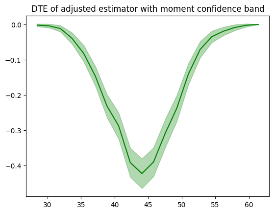
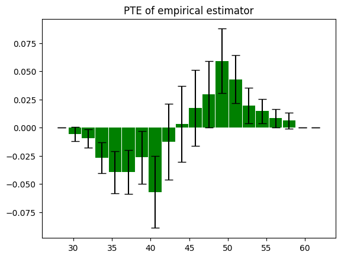
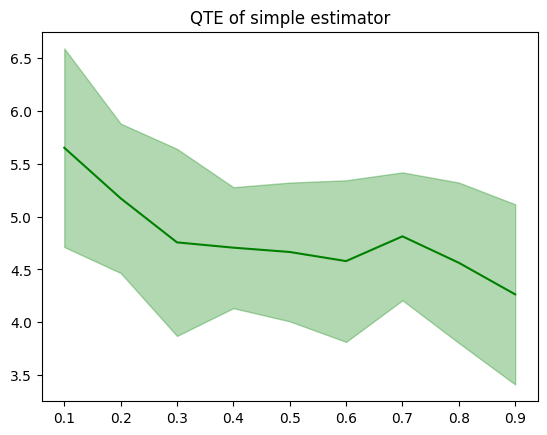

# Summary

`dte_adj` is a Python package designed for estimating distributional treatment effects (DTEs) in randomized experiments. Unlike traditional approaches that focus on average treatment effects, `dte_adj` enables researchers to analyze the full distributional impact of interventions across different outcome levels. The package implements machine learning-enhanced regression adjustment methods to achieve variance reduction, making distributional effect estimation more precise and computationally efficient. It supports multiple experimental designs including simple randomization, covariate-adaptive randomization (CAR), and local distributional treatment effect (LDTE) estimation. The package provides a scikit-learn compatible API and comprehensive functionality for computing distribution functions, probability treatment effects, and quantile treatment effects with confidence intervals.

# Statement of Need

Randomized experiments (RCTs, also known as A/B tests) have been fundamental to scientific inquiry since the pioneering work of @fisher1935design, providing the gold standard for causal inference. While most experimental analyses focus on average treatment effects (ATEs), many research questions require understanding how treatments affect the entire distribution of outcomes, not just the mean. Distributional treatment effects (DTEs) capture these richer patterns, revealing heterogeneous impacts across different outcome levels that averages can mask.

Despite the growing importance of distributional analysis in fields ranging from economics to medicine, the Python ecosystem lacks comprehensive tools for DTE estimation. While SciPy provides basic empirical cumulative distribution functions, it offers no specialized functionality for treatment effect estimation, variance reduction, or confidence interval construction in experimental settings. Existing Python packages for causal inference, such as DoWhy [@dowhy] and EconML [@econml], focus primarily on average treatment effects and conditional average treatment effects (CATE), with EconML incorporating machine learning for heterogeneous treatment effect estimation. However, these packages do not address distributional treatment effects, which capture how treatments affect the entire outcome distribution rather than just the mean. Existing R packages like `RDDtools` focus on regression discontinuity rather than randomized experiments, and lack modern machine learning integration.

`dte_adj` addresses this gap by providing a comprehensive Python framework for distributional treatment effect analysis. The package implements state-of-the-art variance reduction techniques using machine learning models for regression adjustment [@byambadalai2024estimatingdistributionaltreatmenteffects], enabling more precise DTE estimates with smaller sample sizes. It supports multiple experimental designs including covariate-adaptive randomization [@byambadalai2025efficientestimationdistributionaltreatment] and local treatment effects, with a scikit-learn [@scikit-learn] compatible API that integrates seamlessly into existing machine learning workflows. This makes advanced distributional analysis accessible to the broader Python research community, supporting more nuanced causal inference in experimental studies.

# Features

`dte_adj` provides a comprehensive suite of tools for distributional treatment effect analysis:

## Estimator Classes

The package implements multiple estimator classes following a hierarchical design pattern:

**Simple Randomization Estimators:**
- `SimpleDistributionEstimator`: Basic empirical distribution function estimator for simple randomized experiments
- `AdjustedDistributionEstimator`: Machine learning-enhanced estimator with regression adjustment for variance reduction

**Stratified Estimators (for Covariate-Adaptive Randomization):**
- `SimpleStratifiedDistributionEstimator`: Handles stratified block randomization designs
- `AdjustedStratifiedDistributionEstimator`: Combines stratification with ML-based variance reduction

**Local Distribution Estimators (for Imperfect Compliance):**
- `SimpleLocalDistributionEstimator`: Estimates local distributional treatment effects (LDTE) for settings with imperfect compliance
- `AdjustedLocalDistributionEstimator`: LDTE estimation with ML adjustment for improved precision [@byambadalai2025imperfectcompliance]

## Core Methods

All estimators implement a consistent API with three primary methods:

- `predict_dte()`: Computes Distributional Treatment Effects $DTE_{w, w'}(y) := F_{Y(w)}(y) - F_{Y(w')}(y)$, where $F_{Y(w)}(y)$ represents the cumulative distribution function for treatment $w$ at outcome level $y$.

- `predict_pte()`: Computes Probability Treatment Effects over specified intervals, measuring differences in probability mass between treatment groups.

- `predict_qte()`: Computes Quantile Treatment Effects $QTE_{w, w'}(\tau) := F_{Y(w)}^{-1}(\tau) - F_{Y(w')}^{-1}(\tau)$, comparing quantiles across treatments.

## Advanced Features

**Multi-task Learning:** The package supports multi-task neural networks (`is_multi_task=True`) for computational efficiency when analyzing many outcome locations simultaneously [@hirata2025efficientscalableestimationdistributional].

**Cross-fitting:** Adjusted estimators use K-fold cross-fitting to prevent overfitting in machine learning models, ensuring robust treatment effect estimates.

**Confidence Intervals:** Built-in bootstrap methods provide confidence intervals with multiple variance estimation approaches (`moment`, `simple`, `uniform`).

**Visualization:** The `dte_adj.plot` module enables easy plotting of treatment effects and confidence bands.

# Acknowledgements

We thank CyberAgent, Inc. for supporting this research and the open-source community for valuable feedback during development.

# References
